**ASIA PACIFIC UNIVERSITY OF TECHNOLOGY & INNOVATION**

**Individual Assignment**

| Module code | CT046-3-M |
| --- | --- |
| Module name | Applied Machine Learning |
| Intake code | CSSE / CT046-3-M-AML-L-1 / 2026-01-26 |
| Hand-out date | 25 May 2026 |
| Hand-in date | 24 July 2026 |
| Weightage | 100% |
| Student name | Tanjim Noor |
| Student ID | TP166089 |

  

**Declaration**

I declare that this work is my own except where the work of others is clearly acknowledged and cited. I have not presented it, in whole or in part, for another academic award.

Generative-AI assistance was used for literature organisation, code review, language editing and document preparation. The student verified the sources, numerical results, interpretations and final wording and accepts responsibility for the submitted work.

| Student name | Tanjim Noor |
| --- | --- |
| Student ID | TP166089 |

<!-- Page break in the submitted DOCX -->

**Predicting Semester GPA Change from Student Context and Generative AI Use: A Comparative Machine Learning Study**

────────────────────────

**CT046-3-M: Applied Machine Learning**

Submitted by

**Tanjim Noor**

TP166089

Asia Pacific University of Technology & Innovation

Submission date: 31 July 2026

<!-- Page break in the submitted DOCX -->

**Abstract**

Generative-AI tools are increasingly used in higher education, yet their relationship with academic performance remains mixed and context-dependent. This study examined whether recorded AI-use variables improved out-of-sample prediction of semester GPA change beyond previous GPA and general study context, and which regression model offered the strongest balance of accuracy, stability and complexity. The Kaggle Impact of AI on Students dataset contained 50,000 records and 16 source variables. Data quality, validity and distributions were examined before modelling; no valid observations were altered. GPA change was defined as post-semester minus pre-semester GPA. The unique student identifier, post-semester GPA and two other post-outcome variables were excluded to prevent meaningless identification and outcome leakage. A mean baseline, Linear Regression, Ridge Regression, Random Forest and Histogram Gradient Boosting (HGB) were compared through an 80/20 development-test split and shuffled five-fold cross-validation. The combined context-and-AI feature set achieved test R² = 0.4170, compared with 0.2382 for context only and 0.1703 for AI variables only. Tuned HGB achieved test MAE 0.1112, RMSE 0.1414 and R² = 0.4185; bootstrap 95% intervals were 0.1095–0.1130, 0.1394–0.1434 and 0.4007–0.4360, respectively. Three neural architectures were also evaluated. FT-Transformer produced the best neural cross-validation RMSE of 0.1440, but its 0.20% improvement over HGB was below a predefined 1% material-improvement threshold. HGB was therefore retained because it provided comparable accuracy with lower complexity. Traditional study hours, primary AI use case and weekly GenAI hours were the three strongest permutation importances. The results show incremental predictive information, not a causal effect of AI use. Undocumented dataset provenance and substantially higher error for GPA decreases preclude individual or policy decisions from this model.

<!-- Page break in the submitted DOCX -->

**Table of Contents**

1 Introduction, Aim and Objectives    1

1.1 Problem context    1

1.2 Dataset and analytical problem    1

1.3 Research question    2

1.4 Aim    2

1.5 Objectives    2

1.6 Scope and contribution    3

2 Related Works    4

2.1 Review method    4

2.2 AI in higher education    5

2.3 Mixed evidence on academic outcomes    5

2.4 AI literacy and prompt skill    6

2.5 Predicting academic performance    6

2.6 Methodological and software foundations    6

2.7 Comparative synthesis and research gap    7

3 Methods    9

3.1 Research design    9

3.2 Data and feature groups    9

3.3 Experimental procedure    10

4 Dataset Preparation    13

4.1 Data understanding, audit and target construction    13

4.2 Preparation and leakage control    22

5 Model Implementation    24

5.1 Common pipeline    24

5.2 Candidate regressors    24

5.3 Feature-set ablation    25

5.4 Hyperparameter optimisation    26

5.5 Neural-model comparison and selection decision    27

5.6 Final fitting and interpretation outputs    28

6 Model Validation    29

6.1 Cross-validation and model selection    29

6.2 Test confirmation    30

6.3 Residual behaviour    33

6.4 Direction-specific error and bias risk    35

7 Analysis and Recommendations    37

7.1 Answer to the research question    37

7.2 Why nonlinear models performed better    38

7.3 Predictive importance and anomalies    39

7.4 Relationship to prior evidence    40

7.5 Recommendations    41

8 Interactive Prediction Demonstration    42

8.1 Purpose and prediction modes    42

8.2 Worked example and interpretation    43

9 Conclusion    44

References    45

Acknowledgements    47

<!-- Page break in the submitted DOCX -->

**List of Figures**

Figure 1. Data-quality results and original field-type composition. Zero counts for missing cells, duplicate rows, duplicate identifiers and invalid-range rows document why no corrective cleaning was applied.    13

Figure 2(a). Distributions of previous GPA, traditional-study hours and exam anxiety.    14

Figure 2(b). Distributions of weekly GenAI hours, tool diversity and perceived AI dependency.    15

Figure 2(c). Distributions of post-semester GPA and skill retention, which were excluded post-outcome fields.    16

Figure 3(a). Frequency distributions of major, year of study and institutional policy.    17

Figure 3(b). Frequency distributions of primary AI use case, prompt skill and paid subscription.    18

Figure 4. Panel (a) shows the numeric correlation matrix; panel (b) shows the sampled relationship between previous GPA and GPA change. Post-semester outcomes are excluded from the predictor-focused matrix.    19

Figure 5. Panel (a) shows counts by observed direction; panel (b) shows the continuous distributions of decreases, unchanged values and increases. The continuous target was retained without balancing.    20

Figure 6. Panel (a) shows the target distribution, panel (b) its relationship with previous GPA, panel (c) prompt-skill differences and panel (d) weekly GenAI-hours quartiles. Error bars show 95% confidence intervals for group means.    21

Figure 7. Panel (a) compares reserved-test RMSE by model; panel (b) compares actual and predicted GPA change for tuned HGB. The dashed diagonal represents perfect predictions.    32

Figure 8. Panel (a) plots residuals against predicted GPA change; panel (b) shows the residual distribution for tuned HGB.    34

Figure 9. Panel (a) compares test MAE and RMSE by observed GPA-change direction; panel (b) shows the corresponding residual distributions. The same tuned model and reserved test set are used for all groups.    36

Figure 10. Test-set permutation importance for the selected tuned HGB model. Values show the mean deterioration in RMSE-based score after shuffling each source feature across five repetitions.    39

Figure 11. Completed prediction form in comparison mode. Academic context is held constant while the second card supplies the recorded AI-related information used by the matched combined pipeline.    42

Figure 12. Side-by-side worked-example predictions for identical academic context. Adding recorded AI-related information changes the fitted prediction from +0.267 to +0.335, a +0.068 information-based prediction difference.    43

<!-- Page break in the submitted DOCX -->

**List of Tables**

Table 1. Search coverage and screening outcome    4

Table 2. Core literature informing the study    7

Table 3. Experimental workflow and evidence role    12

Table 4. Dataset preparation decisions    22

Table 5. Candidate model specification    25

Table 6. HGB randomised-search space and selected configuration    26

Table 7. Neural-model comparison    27

Table 8. Five-fold cross-validation performance    29

Table 9. Reserved-test confirmation    30

Table 10. Bootstrap uncertainty for selected-model test performance    31

Table 11. HGB feature-set comparison    37

# 1 Introduction, Aim and Objectives

## 1.1 Problem context

Generative artificial intelligence (GenAI) tools can produce explanations, drafts, summaries, code and feedback in response to natural-language prompts. Their rapid adoption has moved educational AI beyond systems selected by an institution: students can now decide whether, why and how intensively to use such tools. Earlier higher-education research already treated profiling and prediction as major AI applications (Zawacki-Richter et al., 2019), while more recent reviews identify prediction, assessment, tutoring and AI assistance across the field (Crompton & Burke, 2023). GenAI adds a difficult question to this landscape: do recorded differences in student use help explain or predict academic outcomes after conventional study context is considered?

Academic performance is often represented by grade point average (GPA). Raw post-semester GPA, however, is strongly related to previous GPA and can make a model appear successful without explaining academic change. Semester GPA change is defined here as post-semester GPA minus pre-semester GPA. A positive number indicates improvement and a negative number indicates decline. Predicting this continuous difference retains both direction and magnitude, whereas a binary “improved/not improved” label would treat a change of 0.02 as equivalent to a change of 0.80.

The educational literature does not justify assuming that greater AI exposure will improve performance. Early reviews describe opportunities for tutoring, feedback and independent study but also identify inaccuracy, over-reliance and academic-integrity risks (Kasneci et al., 2023; Lo, 2023). Empirical results also depend on how use and performance are measured. It is therefore more defensible to ask whether AI-related fields contain predictive information than whether AI use caused GPA change.

## 1.2 Dataset and analytical problem

The analysis used the Kaggle Impact of AI on Students dataset (Nagi sisiro, 2026). It contains 50,000 student records and 16 source variables covering major, year of study, previous GPA, conventional study hours, exam anxiety, weekly GenAI hours, use case, prompt skill, tool diversity, subscription, perceived dependency, institutional policy and post-semester outcomes. Its scale and mixture of numeric and categorical variables support a controlled comparison of regression algorithms.

Its strengths are accompanied by substantial limitations. Kaggle does not document the institution, country, sampling design, collection instrument, observation period, ethics procedure or whether the records are observed or synthetic. The data also contain no missing values or duplicate rows. These conditions permit a rigorous machine-learning comparison but do not support population prevalence estimates or recommendations that students change AI use to alter GPA.

The modelling problem was designed around leakage control. The derived GPA-change target could be reconstructed if post-semester GPA were retained as a predictor, so that variable was excluded. The student identifier and the separate post-semester outcomes of skill retention and burnout risk were also removed. Context variables and AI variables were compared separately and together, then five candidate regressors were evaluated using a common development-test split and five-fold cross-validation.

## 1.3 Research question

To what extent do AI-usage variables improve out-of-sample prediction of semester GPA change beyond previous GPA and general study context, and which regression model provides the strongest validated performance?

This wording sets two boundaries. “Out-of-sample” requires evaluation on rows not used to fit the corresponding model. “Prediction” limits the conclusion to associations within the supplied data.

## 1.4 Aim

The primary aim of this study was to build and critically evaluate leakage-controlled regression models for semester GPA change, with particular attention to the incremental predictive value of AI-usage variables.

## 1.5 Objectives

1. Examine the dataset's structure, integrity and GPA-change distribution without modifying the raw CSV or manufacturing data-quality problems.

2. Construct a defensible continuous GPA-change target and define separate context, AI-only and combined predictor groups.

3. Prevent identifier and post-outcome leakage through explicit feature exclusions and fold-local preprocessing.

4. Compare a mean baseline, Linear Regression, Ridge Regression, Random Forest and Histogram Gradient Boosting using consistent five-fold cross-validation.

5. Tune the strongest nonlinear model using development data only and confirm performance on a reserved 20% test set.

6. Interpret residuals, error tolerances and permutation importance against the literature, then make recommendations proportionate to the evidence.

## 1.6 Scope and contribution

The study contributes a reproducible comparison of linear, tree-ensemble and neural models, an explicit context-versus-AI feature ablation, and a validation hierarchy that uses cross-validation for selection and the test set for confirmation. The analysis also connects predictive findings to a structured literature review while distinguishing association from causal explanation. The sequence moves from the research evidence and analytical design to data preparation, model construction, validation, interpretation and practical limits.

# 2 Related Works

## 2.1 Review method

A structured search on 1 July 2026 covered generative-AI use and academic performance, AI literacy and prompting, student-performance prediction, and the exact Kaggle dataset. ERIC and Crossref were supplemented by Semantic Scholar and publisher or DOI records. OpenAlex was unavailable because anonymous access required credentials or returned a rate limit; this was recorded as missing coverage rather than negative evidence.

English work from 2016–2026 was prioritised, with post-2022 emphasis for GenAI. Eligible records were empirical higher-education studies, relevant reviews and primary methodological sources. Promotional, unverifiable, school-only, outcome-irrelevant and duplicate records were excluded. Fifty discovery records were inspected; 15 domain records were verified by DOI, title, author and year, alongside ten methodological or software publications. No inspectable peer-reviewed benchmark using the exact dataset was located. The process was systematic and reproducible but was not a complete PRISMA review.

Table 1. Search coverage and screening outcome

| Source | Search role | Records inspected | Core records retained |
| --- | --- | --- | --- |
| ERIC | All four query families | 17 | 10 before cross-database deduplication |
| Crossref | Broad discovery and targeted DOI verification | 20 broad results plus 15 DOI checks | 15 verified DOI records |
| Semantic Scholar | Supplementary public-result discovery | 13 | 3 before deduplication |
| OpenAlex | Planned discovery source | 0 | 0; access unavailable |
| Kaggle | Exact-dataset search | Dataset metadata only | Dataset source; no comparative study |

Counts overlap because studies appeared through several routes. Degraded database access was recorded rather than interpreted as negative evidence, and no unverified comparative analysis was admitted.

Quality appraisal covered design, sample, outcome, validation, leakage, self-reporting and causal overreach. It prevented pooled effects, classification accuracy and observational associations from being transferred uncritically to this regression.

## 2.2 AI in higher education

Zawacki-Richter et al. (2019) reviewed 146 higher-education studies and identified prediction, assessment, personalisation and tutoring as major AI applications, while noting limited educator involvement and ethical attention. Crompton and Burke (2023) found similar uses across 138 later studies. These reviews establish prediction as a longstanding application but largely precede widespread student-controlled GenAI.

Conversational systems shifted the question from institution-selected analytics to student-controlled use. Lo (2023) and Kasneci et al. (2023) connected tutoring, feedback and personalisation opportunities with accuracy, integrity, bias and dependency risks. Their early evidence was more developed conceptually than empirically, supporting a multidimensional treatment of use rather than a presumption of uniform benefit or harm.

## 2.3 Mixed evidence on academic outcomes

Empirical findings reject a simple “more AI means better performance” relationship. Sun and Zhou's (2024) meta-analysis of 65 studies reported a medium positive pooled achievement effect (g = 0.533), but effects varied by activity, content and sample, and mainly concerned structured interventions. The result does not imply a universal benefit from usage hours.

Abbas et al. (2024), using a three-wave survey of 494 Pakistani students, associated greater reported use with procrastination, memory loss and lower reported performance. Molerov et al. (2026) found that German chatbot users completed reasoning tasks faster but not more accurately; frequent users passed more examinations without better grades. Self-reporting, self-selection and contextual specificity limit causal interpretation. Together, the studies indicate that purpose, quality and context must accompany quantity.

## 2.4 AI literacy and prompt skill

Ng et al. (2021) organised AI literacy around understanding, application, evaluation, creation and ethics. Laupichler et al. (2022) similarly found that definitions and assessment instruments remained immature. Lee and Palmer's (2025) review showed that prompting can be learnt but also depends on domain knowledge, critical evaluation and iteration. Prompt-engineering skill is therefore a plausible predictor, not a validated measure of complete AI literacy. Purpose, hours, tool diversity, access, dependency and policy provide additional context.

## 2.5 Predicting academic performance

Alyahyan and Düştegör (2020) emphasised alignment among outcome definition, features, preprocessing, algorithms and evaluation. Hellas et al. (2018) found recurring validation and reporting weaknesses across 357 student-prediction studies. These findings support a specific GPA-change outcome and fold-local preprocessing.

Waheed et al. (2020) found deep models effective with demographics, assessment and clickstream data, while Yağcı (2022) found Random Forest, neural networks and support vector machines competitive for examination classification. Their institutions, inputs, targets and accuracy metrics differ from GPA-change regression, so they inform model choice rather than provide numerical benchmarks. Probst et al. (2019) further showed that ensemble behaviour depends on configuration, supporting explicit tuning and identical-fold comparison.

## 2.6 Methodological and software foundations

The technical design followed primary sources for Ridge shrinkage (Hoerl & Kennard, 1970), Random Forest (Breiman, 2001), gradient boosting (Friedman, 2001), cross-validation (Arlot & Celisse, 2010), random search (Bergstra & Bengio, 2012) and permutation-based model reliance (Fisher et al., 2019). Software sources are cited in Methods, where the corresponding tools are used.

## 2.7 Comparative synthesis and research gap

Table 2. Core literature informing the study

| Source | Design and context | Main contribution | Limitation and relevance |
| --- | --- | --- | --- |
| Higher-education AI reviews (Zawacki-Richter et al., 2019; Crompton & Burke, 2023) | Systematic reviews covering 284 studies | Established prediction, assessment, assistance and tutoring as major applications | Much of the evidence predates widespread student-controlled GenAI |
| GenAI opportunities and risks (Lo, 2023; Kasneci et al., 2023) | Rapid review and multidisciplinary synthesis | Connected tutoring and feedback opportunities with reliability, integrity and dependency risks | Early evidence was often conceptual and did not estimate performance effects |
| Academic-outcome evidence (Abbas et al., 2024; Sun & Zhou, 2024; Molerov et al., 2026) | Survey, meta-analysis and panel/quasi-experimental designs | Found positive, adverse and null outcome patterns under different definitions of use | Heterogeneous measures, self-selection and limited causal identification |
| AI literacy and prompting (Ng et al., 2021; Laupichler et al., 2022; Lee & Palmer, 2025) | Exploratory, scoping and systematic reviews | Framed effective use as understanding, evaluation, ethics, domain knowledge and iterative prompting | Definitions and assessments remain heterogeneous and incompletely validated |
| Student prediction and model design (Hellas et al., 2018; Alyahyan & Düştegör, 2020; Waheed et al., 2020; Yağcı, 2022) | Reviews and predictive experiments | Supported careful target definition, leakage control, validation and nonlinear comparison | Most studies used classification outcomes, different contexts and incomparable metrics |

Note. AI = artificial intelligence; GenAI = generative artificial intelligence; VLE = virtual learning environment. The outcomes and metrics summarised in this table are methodologically informative but are not direct numerical benchmarks for GPA-change regression.

Table 2 shows a clear gap between the GenAI-outcomes literature and the student-prediction literature. The former asks whether or how AI relates to learning but often relies on self-report, interventions or broad achievement measures. The latter develops predictive models but usually omits detailed GenAI behaviours and frequently uses classification targets. No defensible analysis using the exact Kaggle dataset was located. It would therefore be misleading to manufacture a same-dataset benchmark.

The present work addresses a narrower gap: it tests whether AI-use variables add held-out predictive information beyond previous GPA and general study context, while comparing linear and nonlinear regressors under a common, leakage-controlled validation procedure. This does not resolve whether AI use improves learning. Its contribution is to separate incremental prediction from causal interpretation and to show how a contemporary but provenance-opaque dataset can be analysed without overstating its evidential value.

# 3 Methods

## 3.1 Research design

This study used a cross-sectional predictive modelling design. Its unit of analysis was one student record, and its outcome was the change between pre-semester and post-semester grade point average (GPA):

GPA change = post-semester GPA − pre-semester GPA

Positive values denote an increase and negative values denote a decrease. Regression was selected because the target is continuous and the magnitude of change matters. Classification would discard this information by treating small and large changes as equivalent categories. Unsupervised clustering was considered but rejected because it identifies groups without using the labelled GPA-change outcome and therefore cannot answer the predictive research question. Time-series methods were also inappropriate because the data contain one record per student rather than repeated temporal observations. The design addresses prediction and comparison; it does not estimate an effect of AI use.

## 3.2 Data and feature groups

The source was the Impact of AI on Students dataset downloaded from Kaggle (Nagi sisiro, 2026). It contained 50,000 records and 16 source variables. The target was derived after loading the data. Twelve predictors were divided into two conceptually distinct groups. The context group contained previous-semester GPA, major category, year of study, traditional study hours and exam anxiety. The AI group contained weekly GenAI hours, primary use case, prompt-engineering skill, tool diversity, paid subscription, perceived AI dependency and institutional policy. Comparing context-only, AI-only and combined models made the research question directly testable.

Four variables were excluded from all predictors. The student identifier had no defensible transferable meaning. Post-semester GPA was used to construct the target and would reveal its outcome. Skill-retention score and burnout-risk level were separate post-semester outcomes. Their removal was a deliberate leakage control rather than optional feature selection.

## 3.3 Experimental procedure

The analysis was implemented in Python 3.13.11 with pandas 3.0.3, NumPy 2.4.6 and scikit-learn 1.9.0. These libraries respectively provided labelled tabular operations, numerical arrays and consistent machine-learning estimators (Harris et al., 2020; McKinney, 2010; Pedregosa et al., 2011). Matplotlib 3.10.9 and seaborn 0.13.2 generated the statistical graphics (Hunter, 2007; Waskom, 2021). A fixed random state of 42 was used. A single random 80/20 split produced 40,000 development records and a reserved test set of 10,000 records. In five-fold cross-validation, the development records were divided into five parts: each model trained on four parts and was evaluated on the remaining part, repeated until every part had served once as validation data. Averaging these five results reduced dependence on one favourable split and provided the evidence used to compare and tune models. The reserved test set was different: its 10,000 records were excluded from training and tuning, then used after model selection to confirm how the chosen procedure performed on unseen data. This separation limits optimistic model selection, although the same test partition supported several prespecified final diagnostics and was therefore not a strict single-look benchmark (Arlot & Celisse, 2010). The same shuffled folds were used for every model. This consistent protocol was important because student-performance prediction studies often differ in targets, data and evaluation choices, making disciplined within-study comparison more informative than isolated scores (Alyahyan & Düştegör, 2020; Hellas et al., 2018).

Preprocessing and estimation were joined in scikit-learn pipelines. Numeric features passed through median imputation and standardisation; categorical and Boolean features passed through most-frequent imputation and one-hot encoding with unknown categories ignored. Although the observed file had no missing values, these steps made the workflow robust to missing or unseen values. Crucially, transformer parameters were fitted within each training fold, not on the complete dataset.

The primary candidate set comprised a mean baseline, ordinary least-squares Linear Regression, Ridge Regression, Random Forest and Histogram Gradient Boosting (HGB). This set provides a deliberate progression from a no-skill reference, through additive models, to bagged and boosted nonlinear ensembles. Three neural alternatives—a category-embedding multilayer perceptron (MLP), FT-Transformer and TabM—were evaluated separately under the same split and five-fold protocol. Mean absolute error (MAE) reported typical absolute error in GPA points. Root mean squared error (RMSE) penalised larger errors more heavily and was the primary selection metric. The coefficient of determination (R²) described the proportion of test-set variation accounted for by the predictions relative to the mean baseline. Lower MAE and RMSE and higher R² indicate better performance.

HGB was selected for optimisation only after it achieved the lowest untuned cross-validated RMSE. RandomizedSearchCV evaluated ten parameter combinations over learning rate, leaf count, minimum leaf size, L2 regularisation and number of boosting iterations. Search, scoring and refitting remained inside the development data. Test outputs were treated as confirmatory: the same reserved partition supported the prespecified feature-set comparison, candidate-model confirmation, residual summaries and permutation importance. It did not alter the search space or trigger model refitting, but these multiple reporting uses mean that it was not a strict single-look test benchmark.

No ethics approval is claimed for the secondary analysis because the dataset was obtained as a public CC0 modelling file and contains only a unique numeric identifier without documented personal meaning. Nevertheless, the source provides no account of consent or ethical review. This absence is an evidence limitation and prevents treating public availability as proof of ethical provenance.

Table 3. Experimental workflow and evidence role

| Stage | Data used | Purpose |
| --- | --- | --- |
| Integrity checks and target construction | All raw records | Verify schema and define the continuous outcome |
| Development-test split | All eligible records | Reserve 20% for final confirmation |
| Five-fold comparison | Development data only | Select the strongest model family |
| Randomised tuning | Development folds only | Optimise the selected HGB family |
| Neural comparison | Development folds and reserved test set | Test whether additional representation complexity materially improves validation RMSE |
| Final evaluation | Reserved test set | Confirm generalisation, quantify uncertainty and inspect errors |
| Permutation importance | Reserved test set | Describe model-specific predictive contribution |

# 4 Dataset Preparation

## 4.1 Data understanding, audit and target construction

The raw CSV was loaded without modification. It contained 50,000 rows and 16 source columns: eight numeric or ordinal measures, six categorical fields, one Boolean field and one integer identifier. The fields covered academic background, study behaviour, generative-AI use, institutional policy, exam anxiety and post-semester outcomes (Nagi sisiro, 2026).

Every field was profiled for data type, non-null count, missing count, cardinality and, where applicable, numeric range. The audit found 50,000 unique student identifiers, no missing cells, no duplicated rows and no duplicated identifiers. Both GPA fields were within 0–4; weekly AI and traditional-study hours were within feasible weekly limits; and diversity, dependency, anxiety and retention measures stayed within their documented scale limits. Complete category-frequency tables exposed every observed level and no inconsistent spellings. Figure 1 summarises the quality checks and field types.

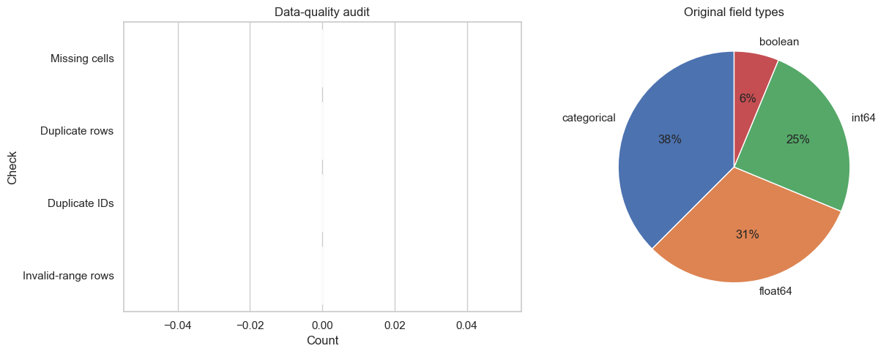

Figure 1. Data-quality results and original field-type composition. Zero counts for missing cells, duplicate rows, duplicate identifiers and invalid-range rows document why no corrective cleaning was applied.

Numeric exploration reported descriptive statistics, distributions and IQR outlier flags for every measured field. Figures 2(a) and 2(b) show the six numeric and ordinal predictors, while Figure 2(c) separately shows the two post-semester outcome fields excluded from prediction. This separation keeps the complete audit visible without implying that excluded outcomes entered the model. Flags prompted inspection, not automatic deletion.

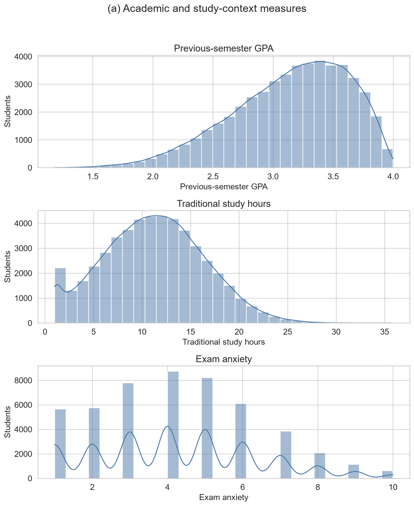

Figure 2(a). Distributions of previous-semester GPA, traditional-study hours and exam anxiety.

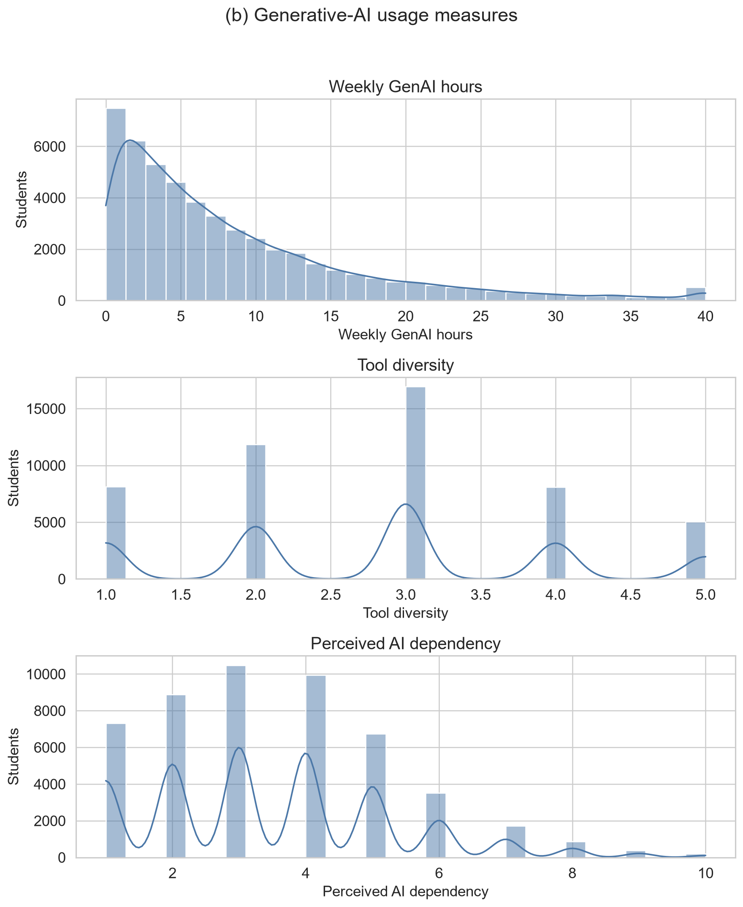

Figure 2(b). Distributions of weekly GenAI hours, tool diversity and perceived AI dependency.

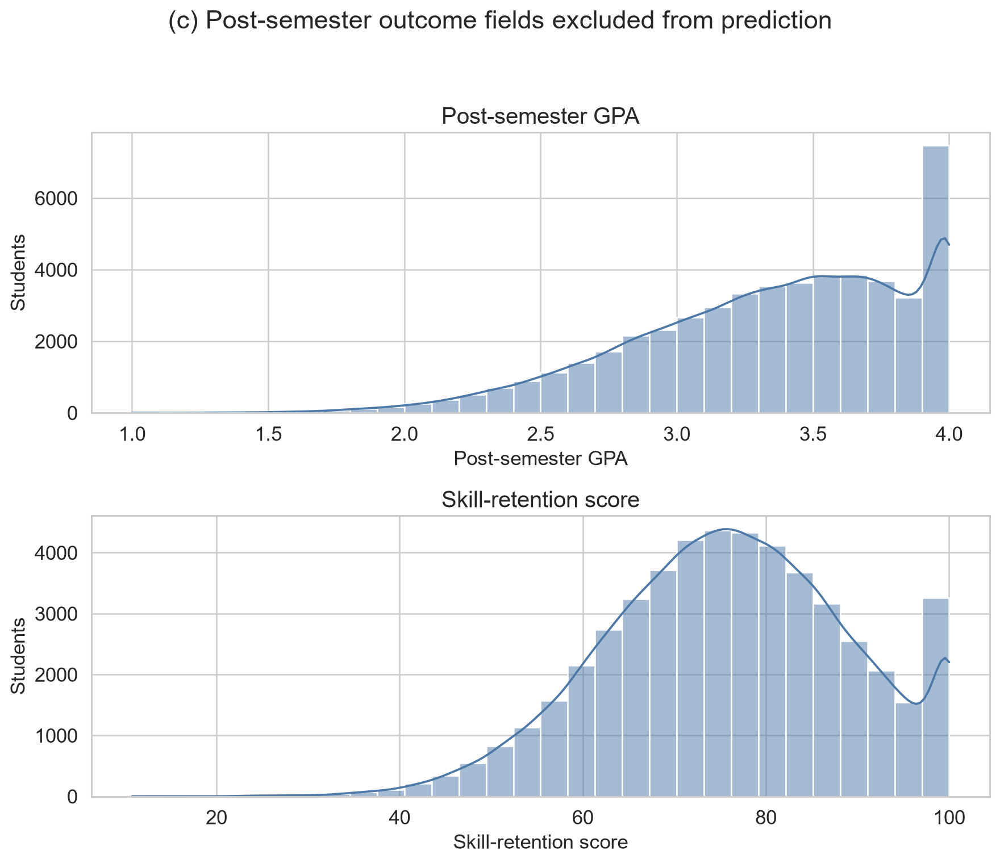

Figure 2(c). Distributions of post-semester GPA and skill retention. Both are post-outcome fields excluded from prediction.

Figures 3(a) and 3(b) report every categorical and Boolean frequency before encoding, separated into academic or institutional context and AI-use or access fields.

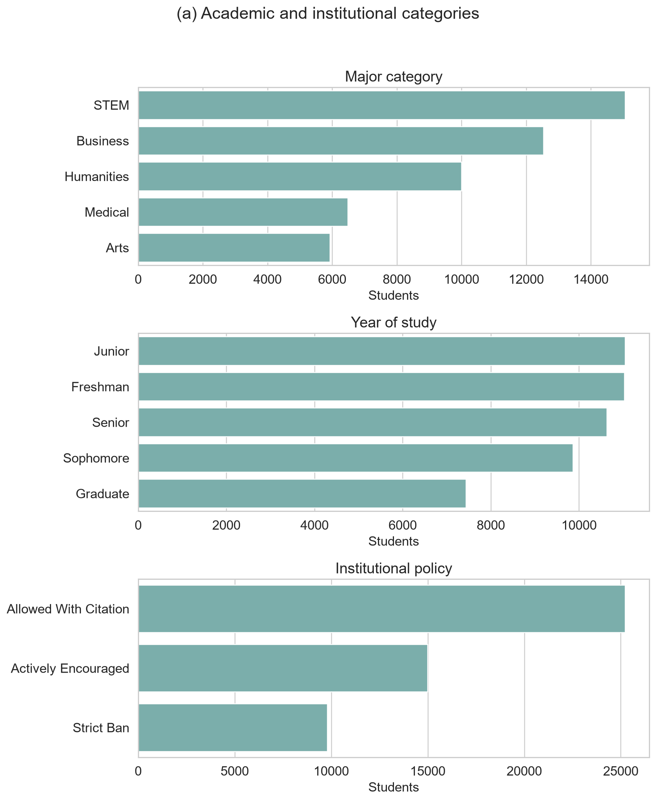

Figure 3(a). Frequency distributions of major, year of study and institutional policy.

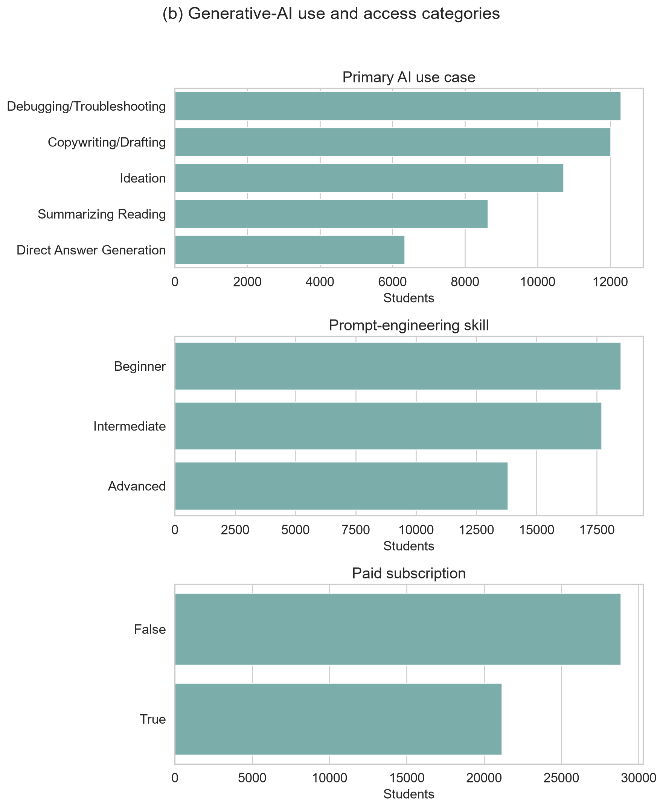

Figure 3(b). Frequency distributions of primary AI use case, prompt-engineering skill and paid subscription.

Semester GPA change was derived as post-semester minus pre-semester GPA, increasing the working dataset to 17 variables without altering the source data. The target mean was 0.2032 GPA points, its standard deviation was 0.1872 and its median was 0.2040, with values from -0.924 to 1.008. Figure 4 presents numeric correlations and the bounded relationship between previous GPA and GPA change. These correlations support exploration of predictive structure but do not establish causation.

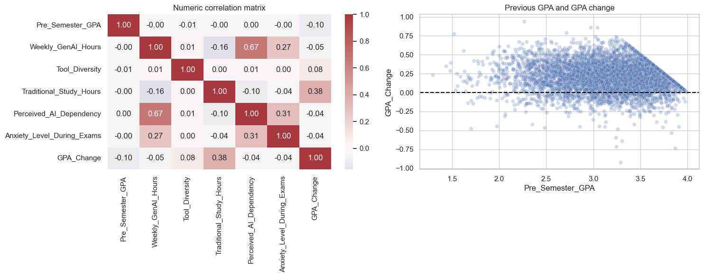

Figure 4. Panel (a) shows the numeric correlation matrix; panel (b) shows the sampled relationship between previous GPA and GPA change. Post-semester outcomes are excluded from the predictor-focused matrix.

There were 43,759 positive changes (87.52%), 6,192 negative changes (12.38%) and 49 unchanged records (0.10%). Figure 5 makes this asymmetry explicit. It is not conventional class imbalance because the model predicts a continuous quantity rather than an increase/decrease class. Resampling by sign would change the observed target distribution and regression estimand. All records were therefore retained, while direction-specific test errors were added to detect performance differences hidden by aggregate metrics.

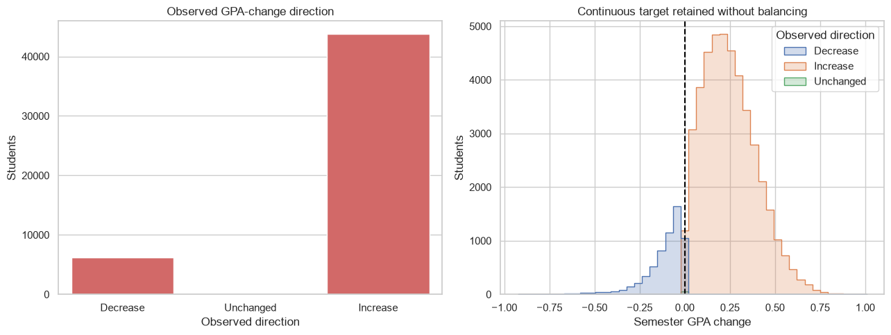

Figure 5. Panel (a) shows counts by observed direction; panel (b) shows the continuous distributions of decreases, unchanged values and increases. The continuous target was retained without balancing.

Figure 6 shows an approximately unimodal target, a GPA-ceiling relationship, prompt-skill differences and non-monotonic AI-hours quartiles. These unadjusted patterns support nonlinear modelling but do not identify causal effects.

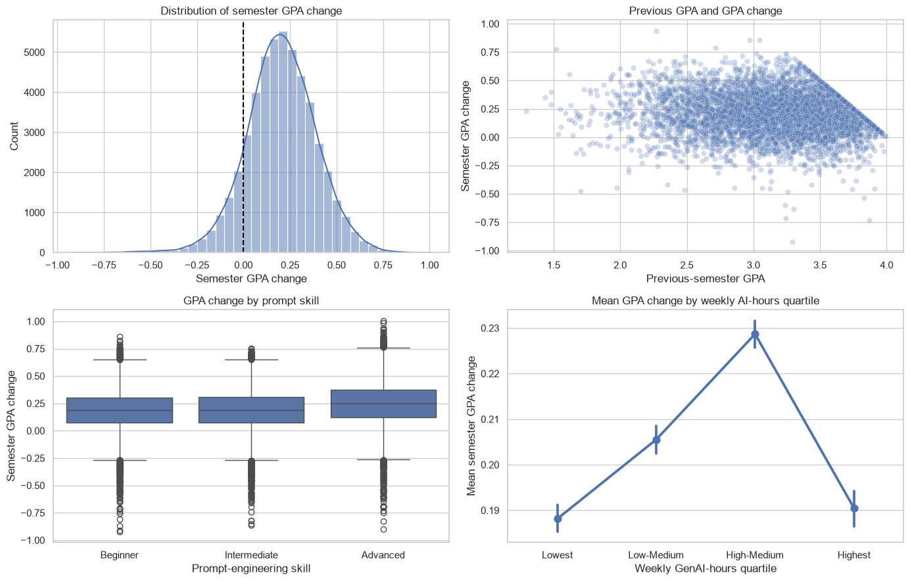

Figure 6. Panel (a) shows the target distribution, panel (b) its relationship with previous GPA, panel (c) prompt-skill differences and panel (d) weekly GenAI-hours quartiles. Error bars show 95% confidence intervals for group means.

## 4.2 Preparation and leakage control

Table 4 records every preparation decision. The student identifier was excluded because record identity has no transferable meaning. Post-semester GPA was used only to construct the target; retaining it as a predictor would reveal the answer. Skill-retention score and burnout-risk level were excluded as separate post-semester outcomes unavailable at the intended prediction point. GPA direction was a diagnostic variable only; models retained continuous GPA change.

Table 4. Dataset preparation decisions

| Action | Fields or rule | Rationale |
| --- | --- | --- |
| Construct target | Post-GPA minus pre-GPA | Preserve magnitude and direction of academic change |
| Remove identifier | Student identifier | Avoid arbitrary record identity |
| Remove target source | Post-semester GPA | Prevent direct outcome leakage |
| Remove other outcomes | Skill-retention score; burnout-risk level | Preserve a predictor-only feature set |
| Audit validity | Missingness, duplicates, ranges, categories, IQR flags | Demonstrate cleaning decisions from evidence |
| Encode categories | Fold-fitted one-hot encoding; ignore unknown levels | Represent nominal values without artificial ordering |
| Prepare numeric fields | Fold-fitted median imputation and standardisation | Provide robustness and linear-model comparability |
| Retain clean observations | No deletion, fabrication or forced transformation | Preserve valid supplied data |
| Retain target distribution | No balancing by GPA-change sign | Preserve the continuous regression estimand |
| Add direction diagnostic | GPA direction, evaluation only | Detect unequal errors hidden by overall averages |

Encoders, imputers and scaling remained inside model pipelines, so every fold learned transformations from training data only. No imputation was activated, but the pipeline defines future missing-value handling without manufacturing present defects.

Complete cleaning was demonstrated through audits, validity rules and the decision log; it does not require changing valid data. Kaggle does not document collection, sampling, ethics or whether records are observed or synthetic. Perfect cleanliness is therefore a provenance warning, not proof of quality.

# 5 Model Implementation

## 5.1 Common pipeline

Every candidate used the same train-test indices, five cross-validation folds and preprocessing architecture. This controlled comparison isolates differences in the estimators rather than allowing each model to benefit from a different data treatment. Numeric columns were median-imputed and standardised. Categorical and Boolean columns were most-frequent-imputed and one-hot encoded. The dense encoded matrix was then supplied to the estimator. Because the preprocessor and estimator formed one Pipeline, fitting within a cross-validation fold could not learn category levels, medians, modes or scale parameters from its validation partition.

The mean baseline was essential even though it was not a learning model. It predicted the development-set mean GPA change for every record and established the minimum performance that a useful regression model should exceed. Its expected R² is around zero on unseen data; a negative value means that even the fixed mean would perform better.

## 5.2 Candidate regressors

Ordinary least-squares Linear Regression provided an interpretable additive benchmark. It assumes that the encoded predictors contribute through linear combinations and therefore cannot directly represent thresholds or interactions. Ridge Regression used the same functional form with an L2 penalty and alpha=1.0. It tests whether shrinking correlated or weak coefficients improves generalisation (Hoerl & Kennard, 1970).

Random Forest represented bagged nonlinear trees with random feature selection (Breiman, 2001). The implementation used 180 trees, a minimum of three samples per leaf and 80% of available features at each split. Model-level parallelism was limited so that cross-validation folds could run in parallel without nested competition for processing resources. A fixed random state made bootstrap sampling and feature selection reproducible. Tree ensembles were suitable because the exploratory patterns suggested thresholds and interactions, and comparable educational-data-mining studies have found tree-based methods competitive with linear and other classifiers (Yağcı, 2022). That prior classification result was methodological context, not a numerical benchmark for this regression.

Histogram Gradient Boosting built trees sequentially, with each iteration reducing residual error from the preceding ensemble. Histogram binning makes the method efficient for 50,000 rows; its stage-wise logic follows gradient boosting (Friedman, 2001). The untuned comparison used 180 boosting iterations, learning rate 0.07 and 31 maximum leaf nodes. Its capacity to learn non-additive structure was relevant to the non-monotonic AI-hours pattern and the ceiling-shaped relation between previous GPA and GPA change.

Table 5. Candidate model specification

| Model | Key implementation settings | Analytical role |
| --- | --- | --- |
| Mean baseline | Development-set mean for every prediction | Minimum predictive reference |
| Linear Regression | Ordinary least squares | Unregularised additive benchmark |
| Ridge Regression | L2 penalty of 1.0 | Regularised additive benchmark |
| Random Forest | 180 trees; minimum leaf 3; 80% features; seed 42 | Bagged nonlinear ensemble |
| HGB | 180 iterations; rate 0.07; 31 leaves; seed 42 | Boosted nonlinear ensemble |

## 5.3 Feature-set ablation

Before the broad model comparison, the same HGB procedure was applied to three feature sets. The context-only model used five academic and study-context variables. The AI-only model used seven AI behaviour, skill and institutional variables. The combined model used all 12. For this ablation, HGB used 150 iterations, learning rate 0.08 and 31 maximum leaf nodes. Holding the estimator and data partition constant meant that the difference between context-only and combined performance could be interpreted as incremental predictive information from the AI feature group within this dataset.

This is not the same as a treatment comparison. Some AI variables may encode unobserved differences in courses, students or institutional settings, and the dataset contains no random assignment or credible non-user control group. Accordingly, the ablation quantifies prediction, not an AI-induced GPA change.

## 5.4 Hyperparameter optimisation

HGB achieved the lowest mean cross-validated RMSE in the untuned comparison and was therefore the only family passed to optimisation. Restricting tuning to the development data preserved the test set for confirmation. A randomised search evaluated ten sampled combinations from the space in Table 6. RMSE was the search objective because it expresses error in GPA points while assigning greater cost to large mistakes. Random search was chosen over a full grid because the five-dimensional Cartesian space contained 432 combinations, most of which would spend computation varying weak dimensions repeatedly. Ten reproducible random draws could inspect different values in every dimension within the available budget (Bergstra & Bengio, 2012). Bayesian or tree-structured adaptive optimisation can select later trials using earlier results and may be more sample-efficient when evaluations are expensive. It was not used because the candidate space was small and discrete, HGB fits were inexpensive, the untuned model was already strong, and a transparent fixed-budget search was sufficient for a controlled model comparison. The small measured tuning gain supports that proportionate choice; a larger adaptive search would be justified only if tuning became a primary research objective.

Table 6. HGB randomised-search space and selected configuration

| Hyperparameter | Candidate values | Selected |
| --- | --- | --- |
| Learning rate | 0.03, 0.05, 0.08, 0.10 | 0.05 |
| Maximum leaf nodes | 15, 31, 63 | 15 |
| Minimum samples per leaf | 10, 20, 40 | 10 |
| L2 regularisation | 0.0, 0.1, 1.0 | 0.1 |
| Maximum iterations | 120, 180, 240 | 180 |

The selected configuration combined a smaller learning rate with 180 iterations, fewer maximum leaves and modest L2 regularisation. This represents gradual learning with constrained tree complexity. Explicitly reporting such controls is important because ensemble performance depends on tuning choices, and broad algorithm labels conceal materially different model capacities (Probst et al., 2019).

The best search score was a five-fold RMSE of 0.1441, compared with 0.1443 for the strongest untuned HGB comparison. The improvement was therefore only 0.0002 GPA points at the displayed precision. The optimisation still demonstrated a valid tuning procedure, but its small gain indicates that the initial HGB settings were already close to the useful region of the tested space.

## 5.5 Neural-model comparison and selection decision

Neural networks were not excluded by assumption. Three architectures were trained under the same 80/20 split and five-fold validation contract. The category-embedding MLP learned dense representations for categorical variables before passing them through fully connected layers. FT-Transformer represented each feature as a token and used attention blocks to learn interactions among tabular variables (Gorishniy et al., 2021). TabM combined several parameter-efficient MLP members to obtain an internal ensemble (Gorishniy et al., 2025). These choices covered a conventional neural baseline, an attention-based tabular model and a modern neural ensemble.

A material-improvement rule was defined before interpreting the neural results: a neural model had to reduce HGB cross-validation RMSE by at least 1% to justify its added complexity. The threshold prevents a very small numerical difference from being presented as a practically important model-selection result.

Table 7. Neural-model comparison

**Panel A. Five-fold cross-validation**

| Model | CV MAE | CV RMSE | CV R² |
| --- | ---: | ---: | ---: |
| HGB reference | 0.1130 | 0.1443 | 0.4080 |
| Category-embedding MLP | 0.1139 | 0.1450 | 0.4027 |
| FT-Transformer | 0.1128 | 0.1440 | 0.4108 |
| TabM | 0.1135 | 0.1447 | 0.4053 |

**Panel B. Reserved-test performance and runtime**

| Model | Test MAE | Test RMSE | Test R² | Runtime |
| --- | ---: | ---: | ---: | ---: |
| HGB reference | 0.1112 | 0.1414 | 0.4185 | — |
| Category-embedding MLP | 0.1119 | 0.1419 | 0.4145 | 88.6 s |
| FT-Transformer | 0.1109 | 0.1410 | 0.4218 | 209.9 s |
| TabM | 0.1113 | 0.1413 | 0.4194 | 65.1 s |

Note. Runtime was not recorded for the HGB reference.

FT-Transformer was the strongest neural alternative, but its cross-validation RMSE improvement over HGB was only 0.20%, below the predefined material threshold. Its test advantage was similarly small. HGB was therefore retained because the validation evidence indicated practically comparable accuracy without the additional training time and architectural complexity. This is a model-selection decision for the present tabular problem, not a general claim that neural networks are unsuitable for educational prediction.

## 5.6 Final fitting and interpretation outputs

After search completion, the best pipeline was refitted on all 40,000 development rows. The same procedure was used to fit the untuned models so that all candidates could be evaluated on the reserved 10,000-row test set. Predictions from the tuned HGB were retained for residual analysis.

Permutation importance was calculated on the test data with RMSE scoring, five repetitions and random state 42. Each source feature was shuffled while the fitted pipeline remained fixed; the mean deterioration in score described how much the model relied on that feature. This method can capture contribution in a nonlinear pipeline but remains sensitive to correlated predictors and the specific fitted model. It was used for interpretation, not for asserting that a feature produced the outcome. Permutation-based importance measures model reliance rather than an independent or causal effect, and correlated predictors can share or mask reliance (Fisher et al., 2019).

# 6 Model Validation

## 6.1 Cross-validation and model selection

Table 8 reports the five-fold development results used for primary model selection. All four trained regressors clearly outperformed the mean baseline. Histogram Gradient Boosting (HGB) had the lowest untuned mean RMSE (0.1443), lowest MAE (0.1130) and highest R² (0.4080). Random Forest ranked second, while Linear and Ridge Regression were effectively identical. The HGB fold-to-fold R² standard deviation was 0.0085, compared with 0.0122 for Random Forest, indicating that the winning untuned model was also comparatively stable across the five partitions. Re-evaluating the selected tuned configuration on the same folds produced MAE 0.1128, RMSE 0.1441, R² = 0.4102 and R² standard deviation 0.0090.

Table 8. Five-fold cross-validation performance

| Model | CV MAE | CV RMSE | CV R² | SD of CV R² |
| --- | ---: | ---: | ---: | ---: |
| Tuned HGB | 0.1128 | 0.1441 | 0.4102 | 0.0090 |
| HGB | 0.1130 | 0.1443 | 0.4080 | 0.0085 |
| Random Forest | 0.1149 | 0.1473 | 0.3833 | 0.0122 |
| Ridge Regression | 0.1261 | 0.1608 | 0.2657 | 0.0104 |
| Linear Regression | 0.1261 | 0.1608 | 0.2657 | 0.0104 |
| Mean baseline | 0.1459 | 0.1876 | -0.0003 | 0.0004 |

Table 9. Reserved-test confirmation

| Model | Test MAE | Test RMSE | Test R² |
| --- | ---: | ---: | ---: |
| Tuned HGB | 0.1112 | 0.1414 | 0.4185 |
| HGB | 0.1114 | 0.1416 | 0.4166 |
| Random Forest | 0.1142 | 0.1448 | 0.3896 |
| Ridge Regression | 0.1242 | 0.1583 | 0.2712 |
| Linear Regression | 0.1242 | 0.1583 | 0.2712 |
| Mean baseline | 0.1444 | 0.1854 | -0.0003 |

Note. CV = cross-validation; HGB = Histogram Gradient Boosting; MAE = mean absolute error; RMSE = root mean squared error; SD = standard deviation.

Fold deviations describe stability, not formal significance. Selection rests on identical-fold average ranking and test confirmation; statistical superiority is not claimed.

## 6.2 Test confirmation

The reserved test results retained the development ranking. As Figure 7 shows, tuned and untuned HGB had the lowest RMSE, followed by Random Forest, the two linear models and the baseline. The tuned HGB achieved MAE 0.1112, RMSE 0.1414 and R² = 0.4185. Relative to the baseline RMSE of 0.1854, its RMSE was approximately 23.7% lower. The improvement over untuned HGB was only 0.0002 RMSE and 0.0019 R², so validation supports HGB strongly but the specific benefit of tuning only weakly. Its test R² was only 0.0105 above the best untuned cross-validation mean, which is consistent with ordinary partition variation and provides no strong indication of severe overfitting.

A deterministic percentile bootstrap with 2,000 row-level resamples quantified sampling uncertainty on the untouched test predictions. Table 10 shows narrow intervals around the selected model's point estimates. The paired bootstrap compared HGB and Random Forest on identical resampled rows; the HGB RMSE improvement remained positive throughout its 95% interval. This supports a genuine performance difference within the supplied test sample, although it cannot address uncertainty caused by undocumented sampling or provenance.

Table 10. Bootstrap uncertainty for selected-model test performance

| Quantity | Estimate | 95% lower | 95% upper |
| --- | ---: | ---: | ---: |
| MAE | 0.1112 | 0.1095 | 0.1130 |
| RMSE | 0.1414 | 0.1394 | 0.1434 |
| R² | 0.4185 | 0.4007 | 0.4360 |
| RMSE improvement over Random Forest | 0.0035 | 0.0028 | 0.0041 |

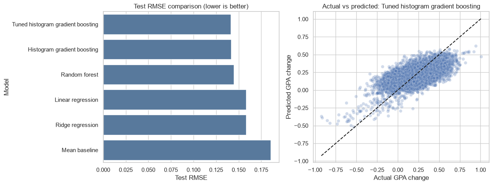

Figure 7. Panel (a) compares reserved-test RMSE by model; panel (b) compares actual and predicted GPA change for tuned HGB. The dashed diagonal represents perfect predictions.

## 6.3 Residual behaviour

Figure 8 shows residuals defined as actual minus predicted GPA change. Their mean was 0.0019 and their standard deviation was 0.1414. The near-zero mean indicates little overall directional bias, but the scatter demonstrates substantial unexplained record-level variation. Predictions also compressed extreme outcomes towards the centre, a common limitation when a model is optimised for average error and extreme cases are sparse.

The median absolute error was 0.0922. Of the 10,000 test predictions, 53.57% were within 0.10 GPA points of the observed change and 84.34% were within 0.20. Remaining error and moderate R² prevent use as a high-confidence individual decision rule.

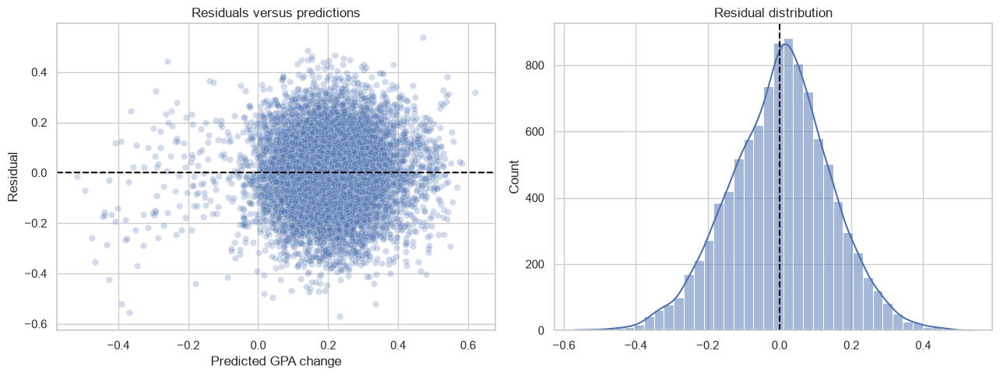

Figure 8. Panel (a) plots residuals against predicted GPA change; panel (b) shows the residual distribution for tuned HGB.

## 6.4 Direction-specific error and bias risk

The asymmetric target made the near-zero overall residual insufficient as a bias check. Of the test observations, 1,203 were decreases, 11 were unchanged and 8,786 were increases. For decreases, MAE was 0.1979, RMSE was 0.2208 and mean residual was -0.1916. Because residual equals actual minus predicted, this shows systematic overprediction: the model pulled GPA declines towards the much more common positive centre. Increase cases had MAE 0.0993, RMSE 0.1266 and mean residual 0.0286. The 11 unchanged cases were too few for a stable subgroup conclusion but had MAE 0.1615.

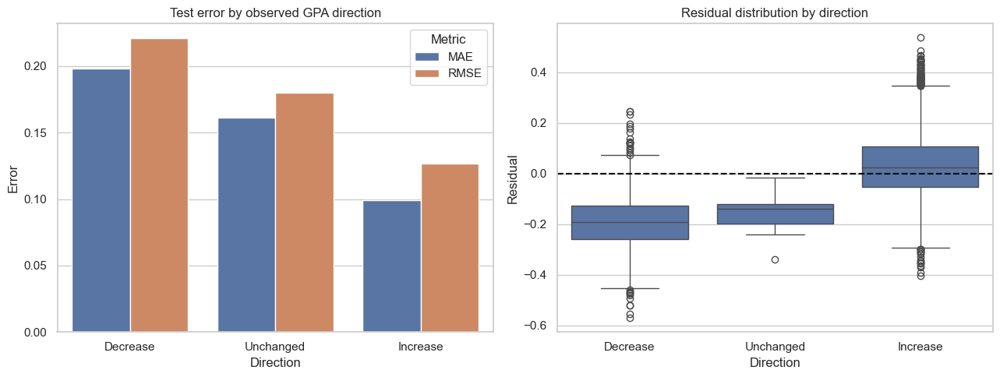

Figure 9. Panel (a) compares test MAE and RMSE by observed GPA-change direction; panel (b) shows the corresponding residual distributions. The same tuned model and reserved test set are used for all groups.

These differences demonstrate predictive bias across outcome regions. Balancing by sign would redefine the continuous outcome, so aggregate and direction-specific results are reported instead. The model should not support individual interventions, especially for possible GPA declines.

The same reserved partition supported several confirmatory summaries, including feature-set comparison, residual diagnostics and permutation importance. No refitting followed those inspections, but repeated analytical use of one test partition can still be more optimistic than evaluation on a genuinely external cohort.

# 7 Analysis and Recommendations

## 7.1 Answer to the research question

The clearest finding is that AI-use variables added out-of-sample predictive information when combined with previous GPA and general study context. As Table 11 shows, the context-only HGB model achieved test R² = 0.2382, while AI variables alone achieved 0.1703. Combining the two groups raised test R² to 0.4170 and reduced RMSE from 0.1618 to 0.1415 relative to context alone. The R² increment was 0.1788. This is a change in predictive performance, not a percentage increase in GPA and not an estimate of an AI effect.

Table 11. HGB feature-set comparison

| Feature set | CV MAE | CV RMSE | CV R² |
| --- | ---: | ---: | ---: |
| Context only | 0.1254 | 0.1638 | 0.2378 |
| AI variables only | 0.1356 | 0.1708 | 0.1708 |
| Context and AI variables | 0.1129 | 0.1443 | 0.4084 |

Reserved-test feature-set performance:

| Feature set | Test MAE | Test RMSE | Test R² |
| --- | ---: | ---: | ---: |
| Context only | 0.1239 | 0.1618 | 0.2382 |
| AI variables only | 0.1347 | 0.1689 | 0.1703 |
| Context and AI variables | 0.1114 | 0.1415 | 0.4170 |

AI variables were therefore informative but insufficient by themselves. The strongest prediction required academic context and AI-related behaviour together. This result is consistent with the wider literature's emphasis on context and quality of use. AI literacy includes understanding, application, evaluation and ethics rather than exposure alone (Ng et al., 2021), while effective prompting also depends on domain knowledge and critical checking (Lee & Palmer, 2025). The result should not be interpreted as validating the dataset's self-described skill measure; it only shows that the recorded AI fields helped this model discriminate between outcomes.

## 7.2 Why nonlinear models performed better

HGB and Random Forest outperformed Linear and Ridge Regression under the same folds and preprocessing. The tuned HGB test RMSE was 0.1414, compared with 0.1448 for Random Forest and 0.1583 for both linear models. This suggests that one additive coefficient per encoded feature did not capture all useful structure. Two descriptive findings support that interpretation. First, mean GPA change rose through the high-medium AI-hours quartile and then fell in the highest quartile. Second, the maximum feasible increase narrows as previous GPA approaches 4.0. Tree ensembles can represent thresholds and interactions without imposing a single straight-line relationship.

This pattern aligns cautiously with educational-data-mining evidence in which tree-based and other nonlinear models have performed competitively (Yağcı, 2022). It does not show that HGB is universally preferable: Waheed et al. (2020), for example, reported a deep model as strongest for a different classification task using virtual-learning data. Model ranking is conditional on the outcome, features, sample and validation protocol.

The optimisation result is also instructive. Randomised search improved HGB cross-validated RMSE from 0.1443 to 0.1441 and test R² from 0.4166 to 0.4185 relative to the untuned HGB. The gain was genuine within the recorded run but small. Tuning therefore refined an already suitable model rather than transforming performance. The search sampled combinations across five interacting dimensions within a fixed computational budget and avoided evaluating all 432 combinations in a full grid. An adaptive Bayesian search might locate a strong region with fewer trials, but its advantage would be more meaningful for expensive evaluations or a larger continuous space. Here, reproducibility, transparency and proportionate computation were prioritised; the modest gain indicates that more elaborate optimisation was unlikely to change the substantive conclusion.

The neural comparison reached the same broader conclusion about complexity. FT-Transformer marginally led HGB on cross-validation RMSE (0.1440 versus 0.1443) and test RMSE (0.1410 versus 0.1414), but the 0.20% validation improvement was below the predefined 1% material threshold and required 209.9 seconds of training. The category-embedding MLP and TabM did not improve cross-validation RMSE. Neural modelling was therefore tested rather than dismissed, but the available evidence did not justify replacing HGB. This result is consistent with the need to match model capacity to tabular data structure and sample evidence rather than assuming that a deeper architecture is automatically superior.

## 7.3 Predictive importance and anomalies

Figure 10 shows that traditional study hours had the largest permutation importance (0.0328 increase in RMSE-based loss when shuffled), followed by primary AI use case (0.0267), weekly GenAI hours (0.0174), year of study (0.0136), prompt-engineering skill (0.0122) and previous-semester GPA (0.0108). Institutional policy and paid subscription made small contributions, while tool diversity, perceived dependency, exam anxiety and major category were near zero in this fitted model.

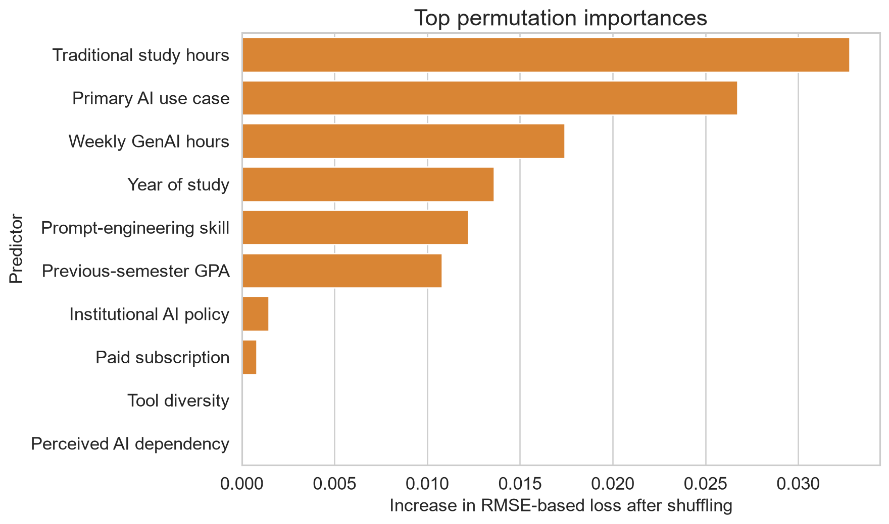

Figure 10. Test-set permutation importance for the selected tuned HGB model. Values show the mean deterioration in RMSE-based score after shuffling each source feature across five repetitions.

Traditional study hours ranking above any AI field is substantively important: AI behaviour did not replace conventional study context. At the same time, purpose of use ranking above weekly hours supports the argument that how a tool is used may be more informative than exposure quantity. The non-monotonic quartile pattern further rejects the simplistic recommendation that more hours should improve GPA.

These importance values do not isolate independent effects. Correlated features can substitute for one another when shuffled, and a variable may be useful because it proxies an unobserved factor. The near-zero importance of perceived dependency, for instance, does not establish that dependency is educationally irrelevant. It means only that shuffling this field did not materially worsen this model's test score after the other recorded predictors were available.

## 7.4 Relationship to prior evidence

Taken together, the results fit the literature's mixed rather than deterministic account of GenAI. Sun and Zhou (2024) found positive average effects in structured interventions, whereas Abbas et al. (2024) reported adverse associations in observational survey data. Molerov et al. (2026) found faster task completion and more examinations passed among users, but no better task accuracy or grades. The current model neither confirms nor refutes those effects because it uses different measures and has no intervention or credible control group. Its contribution is narrower: use-related fields improved prediction within the supplied records, and the form of the association was not simply monotonic.

The final R² of 0.4185 left most test variation unexplained. Missing course, assessment, instructor and socioeconomic context plus extreme-outcome compression require caution.

Direction-specific validation revealed the clearest practical bias risk. Test MAE for GPA decreases (0.1979) was nearly twice that for increases (0.0993), and the mean residual of -0.1916 shows that declines were systematically predicted as less severe. This behaviour is consistent with the 87.52% positive target share and central prediction compression. The result does not justify changing the observed distribution, but it prevents the near-zero overall mean residual from being presented as evidence of equal performance.

## 7.5 Recommendations

First, tuned HGB should be retained as the preferred predictive model because it led the primary cross-validation and test comparison while remaining materially indistinguishable from the strongest, slower neural alternative. It should not be deployed as an intervention rule or used to label individual students as likely to benefit from AI. At most, its outputs could support hypothesis generation after independent validation. Any later deployment study must set direction-specific acceptance thresholds and examine errors across documented demographic and institutional groups that are absent from the data.

Second, future data collection should document the institution, sampling frame, time period, consent, collection instrument and real-versus-synthetic status. Verified behavioural logs should be distinguished from self-report. Course, assessment and instructor variables should be added because they offer plausible explanations for the unexplained variance.

Third, future analysis should predefine a genuine low-use or non-use comparison and follow students longitudinally if the objective changes from prediction to effect estimation. External validation on a separately collected cohort is more valuable than increasingly extensive tuning of the present data.

Finally, educational recommendations should emphasise purposeful and critical use rather than maximising AI hours. Teaching should combine prompt practice with subject knowledge, output verification and ethical judgement, consistent with AI-literacy research (Laupichler et al., 2022; Lee & Palmer, 2025). Whether such support improves GPA requires controlled evaluation; it cannot be inferred from the present feature importances.

# 8 Interactive Prediction Demonstration

## 8.1 Purpose and prediction modes

The interactive demonstration provides a direct, reader-facing way to enter one student profile and inspect the selected model's output. **Context + AI** uses the full leakage-safe feature set. **Context only** uses previous GPA, major, year of study, traditional study hours and exam anxiety while hiding and ignoring the AI-related controls. **Compare both** holds that academic context fixed and presents both fitted predictions together. The training split and tuned histogram gradient boosting configuration remain identical, so the comparison isolates the information supplied to the pipelines rather than changing the modelling procedure.

Figure 11 shows the completed comparison form. Numeric controls are bounded, categories use reader-friendly labels, and identifiers and post-outcome variables are not requested. Invalid programmatic values are rejected. If adding a predicted change to the previous GPA produces a value outside the 0-4 scale, the interface warns the reader and leaves the model output unclipped.

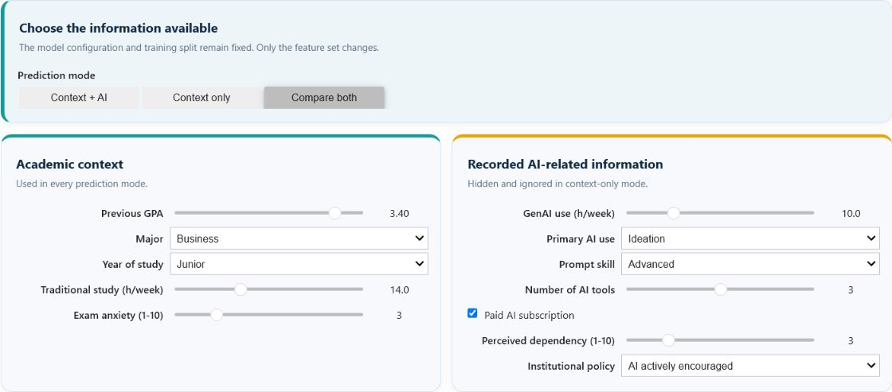

Figure 11. Completed prediction form in comparison mode. Academic context is held constant while the second card supplies the recorded AI-related information used by the matched combined pipeline.

## 8.2 Worked example and interpretation

The worked example uses a previous GPA of 3.40 for a Business student in the junior year, with 14 traditional-study hours per week and exam anxiety of 3. The additional recorded information is 10 weekly GenAI hours, ideation as the primary use, advanced prompt skill, three tools, a paid subscription, perceived dependency of 3 and an institution where AI is actively encouraged.

As Figure 12 shows, the context-only prediction is a GPA change of +0.267, giving an illustrative post-semester GPA of 3.67. With the additional recorded AI-related information, the prediction is +0.335 and the illustration is 3.73. The +0.068 difference describes how the fitted prediction changes when more information is supplied. It is not an estimated effect of AI use.

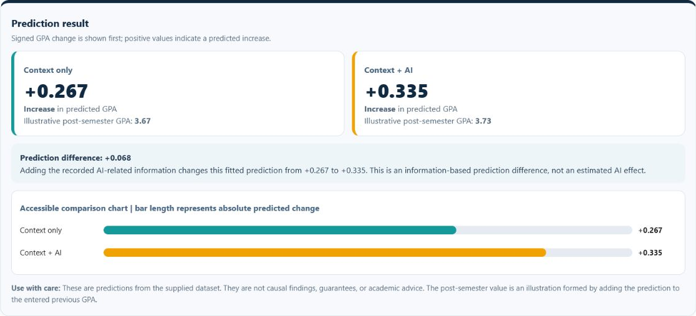

Figure 12. Side-by-side worked-example predictions for identical academic context. Adding recorded AI-related information changes the fitted prediction from +0.267 to +0.335, a +0.068 information-based prediction difference.

The demonstration is a model showcase rather than an academic decision tool. Its outputs are predictive associations learned from the supplied data, not guarantees, causal findings, policy evidence or individual academic advice. The provenance and direction-specific error limitations reported earlier therefore remain fully applicable.

# 9 Conclusion

AI-use variables improved held-out prediction of semester GPA change when combined with previous GPA and general study context. The combined HGB feature set achieved test R² = 0.4170, compared with 0.2382 for context only and 0.1703 for AI variables only. AI variables were therefore useful but insufficient alone; the strongest prediction depended on both study context and AI-related behaviour.

Model comparison showed why the selected method was appropriate. Linear and Ridge Regression provided transparent additive benchmarks, while Random Forest and HGB tested nonlinear thresholds and interactions. HGB produced the strongest primary cross-validation result and its tuned version achieved test MAE 0.1112, RMSE 0.1414 and R² = 0.4185. Bootstrap intervals supported the stability of those test estimates and a positive RMSE advantage over Random Forest within the supplied sample. Randomised tuning improved HGB only slightly, showing that the untuned configuration was already close to the useful region. FT-Transformer was the strongest neural alternative, but its 0.20% cross-validation improvement did not meet the predefined 1% material threshold. HGB consequently offered the most defensible accuracy-complexity trade-off.

The controlled feature and model comparisons were the strongest aspects of the analysis. They showed that nonlinear structure mattered, that conventional study context remained important, and that purpose of AI use was more informative than a simple assumption that additional usage hours should improve GPA. The main weakness was direction-specific performance: MAE was 0.1979 for GPA decreases and 0.0993 for increases, with declines systematically predicted towards the more common positive centre. Moderate overall R² and compressed extreme predictions further limit individual interpretation.

The principal limitation is evidential rather than computational. Collection, sampling, geography, ethics and real-versus-synthetic status are undocumented, while perfect cleanliness reduces confidence that the data reflect unprocessed field observations. Future research should use longitudinal, provenance-rich records; include course, assessment and instructor context; define a credible comparison group; and validate models on an external cohort. Purposeful AI-use measures warrant further investigation, but neither usage hours nor feature importance should be converted into prescriptive educational advice without stronger causal evidence.

# References
- Arlot, S., & Celisse, A. (2010). A survey of cross-validation procedures for model selection. *Statistics Surveys, 4*, 40–79. https://doi.org/10.1214/09-SS054

- Bergstra, J., & Bengio, Y. (2012). Random search for hyper-parameter optimization. *Journal of Machine Learning Research, 13*(10), 281–305. https://jmlr.org/papers/v13/bergstra12a.html

- Breiman, L. (2001). Random forests. *Machine Learning, 45*, 5–32. https://doi.org/10.1023/A:1010933404324

- Fisher, A., Rudin, C., & Dominici, F. (2019). All models are wrong, but many are useful: Learning a variable's importance by studying an entire class of prediction models simultaneously. *Journal of Machine Learning Research, 20*(177), 1–81. https://jmlr.org/papers/v20/18-760.html

- Friedman, J. H. (2001). Greedy function approximation: A gradient boosting machine. *The Annals of Statistics, 29*(5), 1189–1232. https://doi.org/10.1214/aos/1013203451

- Gorishniy, Y., Kotelnikov, A., & Babenko, A. (2025). TabM: Advancing tabular deep learning with parameter-efficient ensembling. *The Thirteenth International Conference on Learning Representations*. https://proceedings.iclr.cc/paper_files/paper/2025/hash/c1ba41c694834aeef91ae161711d4939-Abstract-Conference.html

- Gorishniy, Y., Rubachev, I., Khrulkov, V., & Babenko, A. (2021). Revisiting deep learning models for tabular data. *Advances in Neural Information Processing Systems, 34*, 18932–18943. https://proceedings.neurips.cc/paper_files/paper/2021/hash/9d86d83f925f2149e9edb0ac3b49229c-Abstract.html

- Harris, C. R., Millman, K. J., van der Walt, S. J., et al. (2020). Array programming with NumPy. *Nature, 585*, 357–362. https://doi.org/10.1038/s41586-020-2649-2

- Hoerl, A. E., & Kennard, R. W. (1970). Ridge regression: Biased estimation for nonorthogonal problems. *Technometrics, 12*(1), 55–67. https://doi.org/10.1080/00401706.1970.10488634

- Hunter, J. D. (2007). Matplotlib: A 2D graphics environment. *Computing in Science & Engineering, 9*(3), 90–95. https://doi.org/10.1109/MCSE.2007.55

- McKinney, W. (2010). Data structures for statistical computing in Python. In *Proceedings of the 9th Python in Science Conference* (pp. 56–61). https://doi.org/10.25080/Majora-92bf1922-00a

- Waskom, M. L. (2021). seaborn: Statistical data visualization. *Journal of Open Source Software, 6*(60), 3021. https://doi.org/10.21105/joss.03021

- Abbas, M., Jam, F. A., & Khan, T. I. (2024). Is it harmful or helpful? Examining the causes and consequences of generative AI usage among university students. *International Journal of Educational Technology in Higher Education, 21*(1), Article 10. https://doi.org/10.1186/s41239-024-00444-7

- Alyahyan, E., & Düştegör, D. (2020). Predicting academic success in higher education: Literature review and best practices. *International Journal of Educational Technology in Higher Education, 17*(1), Article 3. https://doi.org/10.1186/s41239-020-0177-7

- Crompton, H., & Burke, D. (2023). Artificial intelligence in higher education: The state of the field. *International Journal of Educational Technology in Higher Education, 20*(1), Article 22. https://doi.org/10.1186/s41239-023-00392-8

- Hellas, A., Ihantola, P., Petersen, A., Ajanovski, V. V., Gutica, M., Hynninen, T., Knutas, A., Leinonen, J., Messom, C., & Liao, S. N. (2018). Predicting academic performance: A systematic literature review. In *Proceedings companion of the 23rd annual ACM **conference on innovation and technology in computer science education* (pp. 175–199). ACM. https://doi.org/10.1145/3293881.3295783

- Kasneci, E., Sessler, K., Küchemann, S., Bannert, M., Dementieva, D., Fischer, F., Gasser, U., Groh, G., Günnemann, S., Hüllermeier, E., Krusche, S., Kutyniok, G., Michaeli, T., Nerdel, C., Pfeffer, J., Poquet, O., Sailer, M., Schmidt, A., Seidel, T., . . . Kasneci, G. (2023). ChatGPT for good? On opportunities and challenges of large language models for education. *Learning and Individual Differences, 103*, 102274. https://doi.org/10.1016/j.lindif.2023.102274

- Laupichler, M. C., Aster, A., Schirch, J., & Raupach, T. (2022). Artificial intelligence literacy in higher and adult education: A scoping literature review. *Computers and Education: Artificial Intelligence, 3*, 100101. https://doi.org/10.1016/j.caeai.2022.100101

- Lee, D., & Palmer, E. (2025). Prompt engineering in higher education: A systematic review to help inform curricula. *International Journal of Educational Technology in Higher Education, 22*(1), Article 7. https://doi.org/10.1186/s41239-025-00503-7

- Lo, C. K. (2023). What is the impact of ChatGPT on education? A rapid review of the literature. *Education Sciences, 13*(4), 410. https://doi.org/10.3390/educsci13040410

- Molerov, D., Federiakin, D., Zlatkin-Troitschanskaia, O., Shenavai, K., Trierweiler, L., & Nagel, M.-T. (2026). The relationship between AI-chatbots use, student assessment performance and learning outcomes in higher education. *Unterrichtswissenschaft*. Advance online publication. https://doi.org/10.1007/s42010-026-00242-2

- Nagi sisiro. (2026). *Impact of Ai on Students* [Data set]. Kaggle. https://www.kaggle.com/datasets/laveshjadon/ai-impact-on-students

- Ng, D. T. K., Leung, J. K. L., Chu, S. K. W., & Qiao, M. S. (2021). Conceptualizing AI literacy: An exploratory review. *Computers and Education: Artificial Intelligence, 2*, 100041. https://doi.org/10.1016/j.caeai.2021.100041

- Pedregosa, F., Varoquaux, G., Gramfort, A., Michel, V., Thirion, B., Grisel, O., Blondel, M., Prettenhofer, P., Weiss, R., Dubourg, V., Vanderplas, J., Passos, A., Cournapeau, D., Brucher, M., Perrot, M., & Duchesnay, É. (2011). Scikit-learn: Machine learning in Python. *Journal of Machine Learning Research, 12*, 2825–2830. https://jmlr.org/papers/v12/pedregosa11a.html

- Probst, P., Wright, M. N., & Boulesteix, A.-L. (2019). Hyperparameters and tuning strategies for random forest. *WIREs Data Mining and Knowledge Discovery, 9*(3), e1301. https://doi.org/10.1002/widm.1301

- Sun, L., & Zhou, L. (2024). Does generative artificial intelligence improve the academic achievement of college students? A meta-analysis. *Journal of Educational Computing Research, 62*(7), 1676–1713. https://doi.org/10.1177/07356331241277937

- Waheed, H., Hassan, S.-U., Aljohani, N. R., Hardman, J., Alelyani, S., & Nawaz, R. (2020). Predicting academic performance of students from VLE big data using deep learning models. *Computers in Human Behavior, 104*, 106189. https://doi.org/10.1016/j.chb.2019.106189

- Yağcı, M. (2022). Educational data mining: Prediction of students' academic performance using machine learning algorithms. *Smart Learning Environments, 9*(1), Article 11. https://doi.org/10.1186/s40561-022-00192-z

- Zawacki-Richter, O., Marín, V. I., Bond, M., & Gouverneur, F. (2019). Systematic review of research on artificial intelligence applications in higher education: Where are the educators? *International Journal of Educational Technology in Higher Education, 16*(1), Article 39. https://doi.org/10.1186/s41239-019-0171-0

# Acknowledgements

The author acknowledges Nagi sisiro for making the *Impact of AI on Students* dataset available through Kaggle, the CT046-3-M-AML teaching team for the learning materials, and the open-source contributors to Python, pandas, NumPy, scikit-learn, Matplotlib, seaborn and Jupyter.

OpenAI Codex was used for literature organisation, code review, language editing and document preparation. The author verified the cited sources, executed model outputs, numerical results, analysis and final wording and remains responsible for the submitted work.
