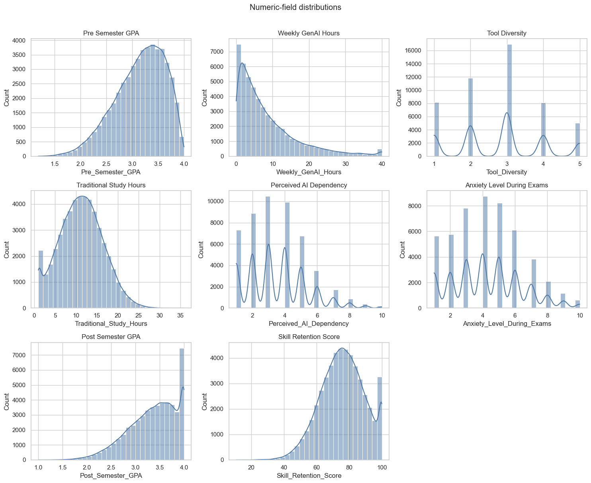
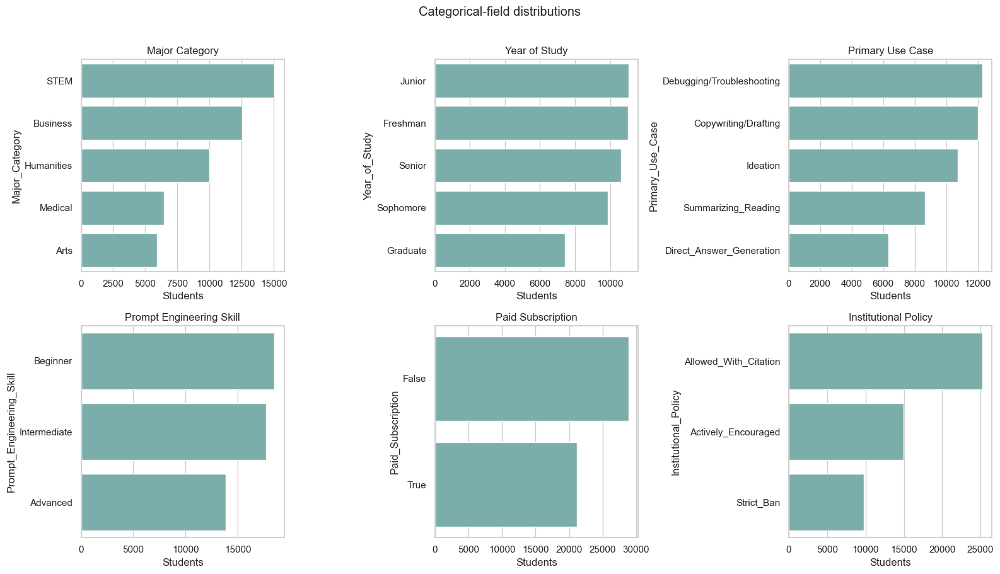

<!-- Generated from Assignment Report/sections in README merge order. -->
<!-- Edit canonical section files, then rerun academic-research/build_merged_report.py. -->

---

# Predicting Semester GPA Change Using Student Context and Generative AI Usage: A Leakage-Controlled Machine Learning Study

## Abstract

Generative-AI tools are used in higher education, but evidence
about their relationship with academic performance remains mixed and
context-dependent. This study investigated whether recorded AI-use variables
improved out-of-sample prediction of semester GPA change beyond previous GPA
and general study context, and which regression model provided the strongest
validated performance. The Kaggle *Impact of Ai on Students* dataset contained
50,000 records and 16 source columns. Every field was audited for completeness,
validity and distribution; no valid observations were changed.
GPA change was defined as post-semester
minus pre-semester GPA. `Student_ID`, post-semester GPA and two other
post-outcome fields were excluded to prevent meaningless identification and
outcome leakage. Numeric and categorical variables were processed through
fold-fitted imputation, standardisation and one-hot encoding. A mean baseline,
Linear Regression, Ridge Regression, Random Forest and Histogram Gradient
Boosting (HGB) were compared using an 80/20 development-test split and shuffled
five-fold cross-validation; HGB was subsequently tuned within the development
data. The combined context-and-AI model achieved test $R^2=0.4170$, compared
with 0.2382 for context only and 0.1703 for AI variables only. Untuned HGB
produced the strongest model-comparison CV RMSE of 0.1443, while tuning reduced
the best CV RMSE to 0.1441. On the reserved test set, tuned HGB achieved MAE
0.1112, RMSE 0.1414 and $R^2=0.4185$; 84.34% of predictions were within 0.20
GPA points. Traditional study hours, primary AI use case and weekly GenAI hours
were the three largest permutation importances. These findings indicate that
AI-related fields supplied additional predictive information when combined
with student context and that nonlinear ensembles represented the recorded
relationships better than linear models. However, undocumented dataset
provenance and much higher error for GPA decreases prohibit causal or
individual-decision conclusions.

---

# Introduction, Aim and Objectives

## Problem context

Generative artificial intelligence (GenAI) tools can produce explanations,
drafts, summaries, code and feedback in response to natural-language prompts.
Their rapid adoption has moved educational AI beyond systems selected by an
institution: students can now decide whether, why and how intensively to use
such tools. Earlier higher-education research already treated profiling and
prediction as major AI applications (Zawacki-Richter et al., 2019), while more
recent reviews identify prediction, assessment, tutoring and AI assistance
across the field (Crompton & Burke, 2023). GenAI adds a difficult question to
this landscape: do recorded differences in student use help explain or predict
academic outcomes after conventional study context is considered?

Academic performance is often represented by grade point average (GPA). Raw
post-semester GPA, however, is strongly related to previous GPA and can make a
model appear successful without explaining academic change. In this report,
*GPA change* refers to post-semester GPA minus pre-semester GPA. A positive
number indicates improvement and a negative number indicates decline.
Predicting this continuous difference retains both direction and magnitude,
whereas a binary “improved/not improved” label would treat a change of 0.02 as
equivalent to a change of 0.80.

The educational literature does not justify assuming that greater AI exposure
will improve performance. Early reviews describe opportunities for tutoring,
feedback and independent study but also identify inaccuracy, over-reliance and
academic-integrity risks (Kasneci et al., 2023; Lo, 2023). Empirical results
also depend on how use and performance are measured. It is therefore more
defensible to ask whether AI-related fields contain *predictive information*
than whether AI use *caused* GPA change.

## Dataset and analytical problem

The analysis used the Kaggle *Impact of Ai on Students* dataset (Nagi sisiro,
2026). It contains 50,000 student records and 16 source columns covering major,
year of study, previous GPA, conventional study hours, exam anxiety, weekly
GenAI hours, use case, prompt skill, tool diversity, subscription, perceived
dependency, institutional policy and post-semester outcomes. The file is large,
mixed-type and suitable for comparing regression algorithms.

Its strengths are accompanied by substantial limitations. Kaggle does not
document the institution, country, sampling design, collection instrument,
observation period, ethics procedure or whether the records are observed or
synthetic. The file also has no missing values or duplicate rows, despite the
assignment's preference for an imperfect dataset. These conditions make it
appropriate for demonstrating a rigorous machine-learning workflow, but not
for estimating population prevalence or recommending that students change AI
use to alter GPA.

The modelling problem was designed around leakage control. The derived
`GPA_Change` target could be reconstructed if `Post_Semester_GPA` were retained
as a predictor, so that field was excluded. `Student_ID` and the separate
post-semester outcomes `Skill_Retention_Score` and `Burnout_Risk_Level` were
also removed. Context variables and AI variables were compared separately and
together, then five candidate regressors were evaluated using a common
development-test split and five-fold cross-validation.

## Research question

> To what extent do AI-usage variables improve out-of-sample prediction of
> semester GPA change beyond previous GPA and general study context, and which
> regression model provides the strongest validated performance?

This wording sets two boundaries. “Out-of-sample” requires evaluation on rows
not used to fit the corresponding model. “Prediction” limits the conclusion to
associations within the supplied data.

## Aim

The primary aim of this study was to build and critically evaluate
leakage-controlled regression models for semester GPA change, with particular
attention to the incremental predictive value of AI-usage variables.

## Objectives

1. Examine the dataset's structure, integrity and GPA-change distribution
   without modifying the raw CSV or manufacturing data-quality problems.
2. Construct a defensible continuous GPA-change target and define separate
   context, AI-only and combined predictor groups.
3. Prevent identifier and post-outcome leakage through explicit feature
   exclusions and fold-local preprocessing.
4. Compare a mean baseline, Linear Regression, Ridge Regression, Random Forest
   and Histogram Gradient Boosting using consistent five-fold
   cross-validation.
5. Tune the strongest nonlinear model using development data only and confirm
   performance on a reserved 20% test set.
6. Interpret residuals, error tolerances and permutation importance against the
   literature, then make recommendations proportionate to the evidence.

## Scope and contribution

The report covers one regression notebook and excludes the supplementary
deep-learning experiments from the reported implementation. Its technical
contribution is a reproducible comparison of linear and nonlinear models, an
explicit context-versus-AI feature ablation, and a validation hierarchy that
uses cross-validation for selection and the test set for confirmation. Its
critical contribution is equally important: it connects model results to a
structured 15-source literature review while distinguishing predictive
association from causal explanation. The following sections first synthesise
the evidence base, then describe preparation, implementation and validation
before analysing the findings and their practical limits.

---

# Related Works

## Review method

A structured multi-database search was conducted on 1 July 2026 to identify
work relevant to generative-AI use, academic outcomes, AI literacy and
student-performance prediction in higher education. Four query families
combined: (1) generative AI or ChatGPT with academic performance; (2) AI-use
behaviour, prompt engineering or AI literacy with student outcomes; (3) machine
learning with GPA or academic-performance prediction; and (4) the exact Kaggle
dataset title, filename and creator. Searches were run through ERIC and
Crossref, supplemented by public Semantic Scholar result pages and publisher or
DOI records. OpenAlex was attempted but its anonymous API required an API key or
returned a rate-limit response; this was recorded as unavailable rather than
interpreted as no evidence.

English publications from 2016 to 2026 were prioritised, with emphasis on work
published after 2022 for generative AI. Eligible records included empirical
higher-education studies, relevant reviews and methodological sources that
could support model design or validation. Promotional material, unverifiable
records, school-only studies, perception studies without a relevant outcome and
duplicates were excluded. Records were deduplicated by DOI and normalised
title. The review inspected 50 discovery records, verified 15 domain records
by DOI, title, author and year, and retained them as the problem-focused core.
Ten primary software or methodological publications were then verified to
document tools, algorithms, tuning, validation and interpretation used in the
implementation.
The exact-dataset search located the Kaggle metadata but no inspectable
peer-reviewed benchmark. The review is therefore reproducible and systematic
in its search logic, but it is not presented as a complete PRISMA systematic
review.

**Table 1. Search coverage and screening outcome**

| Source | Search role | Records inspected | Core records retained |
|---|---|---:|---:|
| ERIC | All four query families | 17 | 10 before cross-database deduplication |
| Crossref | Broad discovery and targeted DOI verification | 20 broad results plus 15 DOI checks | 15 verified DOI records |
| Semantic Scholar | Supplementary public-result discovery | 13 | 3 before deduplication |
| OpenAlex | Planned discovery source | 0 | 0; access unavailable |
| Kaggle | Exact dataset and notebook search | Dataset metadata only | Dataset source; no comparative study |

Counts overlap because studies appeared through several routes. Degraded API
access was recorded rather than interpreted as negative evidence, and no
Kaggle notebook was admitted without inspectable methods and results.

Quality appraisal covered design, sample, outcome, validation, leakage,
self-reporting and causal overreach. It prevented pooled effects,
classification accuracy and observational associations from being transferred
uncritically to this regression.

## AI in higher education

A considerable body of literature has examined artificial intelligence in
higher education, although the focus has changed quickly. Zawacki-Richter et
al. (2019) reviewed 146 studies published between 2007 and 2018 and grouped
applications into profiling and prediction, assessment and evaluation,
adaptive systems and personalisation, and intelligent tutoring. Their review
also identified limited involvement of educators and limited attention to
pedagogical and ethical questions. Crompton and Burke (2023) subsequently
reviewed 138 studies from 2016 to 2022 and found prominent uses in prediction,
assessment, AI assistance, tutoring and learning management. Together, these
reviews establish student prediction as a longstanding application, but they
largely precede widespread student access to generative AI.

The release of general-purpose conversational systems expanded the research
problem from institutional analytics to student-controlled use. Lo's (2023)
rapid review identified opportunities for tutoring, feedback and independent
study alongside risks involving accuracy, academic integrity and over-reliance.
Kasneci et al. (2023) similarly argued that large language models could support
personalisation and feedback, but stressed reliability, bias, assessment and
dependency. These sources justify examining AI use as a multidimensional
context rather than assuming that use is uniformly beneficial or harmful.
However, both reflect an early evidence base in which conceptual discussion was
more developed than direct measurement of academic outcomes.

## Mixed evidence on academic outcomes

Empirical findings do not support a simple relationship between “more AI” and
better performance. Sun and Zhou's (2024) meta-analysis synthesised 65
independent studies from 28 articles and reported a medium positive pooled
effect on academic achievement ($g=0.533$). The effect varied across learning
activities, content and samples, and the intervention designs differed from
uncontrolled everyday use. The pooled result therefore supports the potential
value of structured GenAI-assisted learning, not a universal benefit from usage
hours.

By contrast, Abbas et al. (2024) developed a usage scale and analysed a
three-wave survey of 494 university students in Pakistan. Greater reported use
was associated with procrastination, memory loss and lower reported academic
performance. Temporal separation strengthened the measurement design relative
to a one-time survey, but self-reporting, contextual specificity and
observational modelling still prevent a causal conclusion. Molerov et al.
(2026) provide a further qualification using a German higher-education panel
and verified chatbot-use information. Chatbot users completed reasoning tasks
faster but not more accurately; frequent users passed more examinations but did
not obtain better grades. The authors explicitly treated self-selection and
partial cross-sectional comparison as limits.

The generalisability of this evidence is restricted by differing populations,
tasks, exposure definitions and outcome measures. Positive findings are more
common in structured learning interventions, whereas naturally occurring use
may reflect workload, procrastination, prior skill or course demands. These
differences are not contradictions that can be resolved by counting studies.
They indicate that purpose, quality and context of use need to be represented
alongside quantity.

## AI literacy and prompt skill

AI literacy provides one framework for representing use quality. Ng et al.
(2021) synthesised 30 articles and organised AI literacy around understanding,
application, evaluation and creation, together with ethical awareness. This
definition is broader than operational knowledge of a chatbot. Laupichler et
al. (2022) reached a compatible conclusion after screening 902 records and
including 30 studies in higher and adult education. They found that definitions,
curricula and assessment instruments remained immature, limiting consistent
measurement.

Prompt engineering is one component within this broader capability. Lee and
Palmer's (2025) systematic review of 33 articles found that prompting can be
learnt, but effective practice also requires domain knowledge, critical
evaluation and iterative refinement. The participant base and success criteria
in the literature were limited and heterogeneous. Consequently, a categorical
`Prompt_Engineering_Skill` field can be a plausible predictor, but it should
not be treated as a validated measure of comprehensive AI literacy. The present
dataset also includes purpose of use, weekly hours, tool diversity, paid access,
dependency and institutional policy, allowing a more contextual representation
than hours alone.

## Predicting academic performance

Student-performance prediction is methodologically diverse. Alyahyan and
Düştegör (2020) argued that a useful study begins with a precise outcome and
aligns feature selection, preprocessing, algorithm choice and evaluation with
that outcome. Hellas et al. (2018), reviewing 357 studies, found growth in both
predictors and algorithms but recurring weaknesses in reporting, validation
and replication. These findings support the present focus on change in GPA
rather than raw post-semester GPA, because the former asks a more specific
question and reduces the dominance of previous attainment.

Primary studies show that behavioural and contextual data can support
prediction, although published scores are not directly comparable. Waheed et
al. (2020) used demographics, assessments and virtual-learning-environment
clickstream data to predict performance and reported that deep neural models
outperformed their alternatives. Yağcı (2022) compared six algorithms for
final-examination classification among 1,854 university students and found
Random Forest, neural network and support vector machine among the strongest,
with approximately 70–75% accuracy. Both studies concern classification,
different institutions and different inputs. Their accuracy cannot be compared
with RMSE or $R^2$ for GPA-change regression.

Model labels also conceal consequential implementation choices. Probst et al.
(2019) showed that Random Forest behaviour depends on parameters such as
feature sampling, leaf size and tree count, supporting explicit configuration
and tuning reports. More generally, preprocessing and model selection must be
confined to development folds to prevent leakage. This study therefore compares
all candidates on identical folds, reports variation across folds, tunes only
the development data and reserves a test partition for confirmation.

## Methodological and software foundations

The implementation also depends on literature beyond the educational problem
domain. pandas supplied labelled data structures (McKinney, 2010), NumPy
provided numerical arrays (Harris et al., 2020), and scikit-learn supplied the
common estimator, pipeline and evaluation interfaces (Pedregosa et al., 2011).
Matplotlib and seaborn supported reproducible exploratory and statistical
graphics (Hunter, 2007; Waskom, 2021). These sources document tools used to
produce the work; they are cited in Methods rather than treated as evidence
about student outcomes.

Algorithm choice also had literature foundations. Ordinary and Ridge
Regression supplied additive benchmarks, with Ridge adding coefficient
shrinkage for correlated predictors (Hoerl & Kennard, 1970). Random Forest
represented bootstrap-aggregated randomised trees (Breiman, 2001), while
gradient boosting represented stage-wise fitting to residual error (Friedman,
2001). Random search provided a reproducible, budget-limited alternative to an
exhaustive grid (Bergstra & Bengio, 2012). Cross-validation supported
development-only model selection (Arlot & Celisse, 2010), and permutation
importance was interpreted as fitted-model reliance rather than causal effect
(Fisher et al., 2019). Method citations also appear where each choice is used.

## Comparative synthesis and research gap

**Table 2. Core literature informing the study**

| Source | Design and context | Main contribution | Limitation and relevance |
|---|---|---|---|
| Zawacki-Richter et al. (2019) | Systematic review; 146 higher-education studies | Established prediction as a major AI application | Predates GenAI; motivates educational and ethical scrutiny |
| Crompton and Burke (2023) | Systematic review; 138 studies | Mapped contemporary AI uses in higher education | Search ended as ChatGPT emerged |
| Lo (2023) | Rapid review; 50 publications | Synthesised early ChatGPT opportunities and risks | Early literature was often conceptual |
| Kasneci et al. (2023) | Multidisciplinary position paper | Connected learning support with reliability and dependency risks | No direct performance effect estimate |
| Abbas et al. (2024) | Scale study and three-wave survey; Pakistan | Linked reported use with adverse academic correlates | Self-report and observational design |
| Sun and Zhou (2024) | Meta-analysis; 65 studies, 1,909 participants | Reported a positive pooled achievement effect | Heterogeneous, mainly structured interventions |
| Molerov et al. (2026) | Panel/quasi-experimental assessment; Germany, $N=270$ | Faster completion but not higher task accuracy or grades | Self-selection and limited causal identification |
| Ng et al. (2021) | Exploratory review; 30 articles | Defined AI literacy as understanding, use, evaluation, creation and ethics | Conceptual framework, not a validated measure |
| Laupichler et al. (2022) | Scoping review; 30 included studies | Found immature definitions and assessment of AI literacy | Broad, heterogeneous evidence |
| Lee and Palmer (2025) | Systematic review; 33 articles | Framed prompting as iterative and knowledge-dependent | Small participant base and subjective criteria |
| Alyahyan and Düştegör (2020) | Review and best-practice framework | Emphasised target definition and end-to-end design choices | Source studies used incompatible outcomes |
| Hellas et al. (2018) | Systematic review; 357 studies | Identified validation and reporting weaknesses | Broad educational contexts |
| Waheed et al. (2020) | VLE classification experiment | Demonstrated value of behavioural and prior-assessment data | Different target, setting and metric |
| Yağcı (2022) | Six-model classification comparison; $N=1,854$ | Showed competitive nonlinear models in one course | Accuracy not comparable with regression error |
| Probst et al. (2019) | Methodological review | Explained ensemble parameter and tuning effects | Not education-specific |
| Breiman (2001); Friedman (2001) | Primary ensemble-method papers | Grounded Random Forest and gradient boosting choices | General methods, not educational evidence |
| Arlot and Celisse (2010); Bergstra and Bengio (2012) | Methodological studies | Supported cross-validation and random search | Procedures still depend on suitable splits and search spaces |
| Fisher et al. (2019) | Model-reliance methodology | Supported permutation-based interpretation | Importance remains model- and correlation-dependent |

*Note.* AI = artificial intelligence; GenAI = generative artificial
intelligence; VLE = virtual learning environment. The outcomes and metrics
summarised in this table are methodologically informative but are not direct
numerical benchmarks for GPA-change regression.

Table 2 shows a clear gap between the GenAI-outcomes literature and the
student-prediction literature. The former asks whether or how AI relates to
learning but often relies on self-report, interventions or broad achievement
measures. The latter develops predictive models but usually omits detailed
GenAI behaviours and frequently uses classification targets. No defensible
analysis using the exact Kaggle dataset was located. It would therefore be
misleading to manufacture a same-dataset benchmark.

The present work addresses a narrower gap: it tests whether AI-use variables
add held-out predictive information beyond previous GPA and general study
context, while comparing linear and nonlinear regressors under a common,
leakage-controlled validation procedure. This does not resolve whether AI use
improves learning. Its contribution is to separate incremental prediction from
causal interpretation and to show how a contemporary but provenance-opaque
dataset can be analysed without overstating its evidential value.

---

# Methods

## Research design

This study used a cross-sectional predictive modelling design. Its unit of
analysis was one student record in the supplied tabular dataset, and its
outcome was the change between pre-semester and post-semester grade point
average (GPA). In this report, *GPA change* refers to:

$$
\text{GPA Change}=\text{Post-semester GPA}-\text{Pre-semester GPA}.
$$

Positive values denote an increase and negative values denote a decrease. A
regression design was selected because the target is continuous. This preserves
the magnitude of change that would be lost by reducing the outcome to
“improved” or “declined”. The design addresses prediction and comparison; it
does not estimate an effect of AI use.

## Data and feature groups

The source was the *Impact of Ai on Students* dataset downloaded from Kaggle
(Nagi sisiro, 2026). It contained 50,000 records and 16 source columns. The
target was derived after loading the data. Twelve predictors were divided into
two conceptually distinct groups. The context group contained
`Pre_Semester_GPA`, `Major_Category`, `Year_of_Study`,
`Traditional_Study_Hours` and `Anxiety_Level_During_Exams`. The AI group
contained `Weekly_GenAI_Hours`, `Primary_Use_Case`,
`Prompt_Engineering_Skill`, `Tool_Diversity`, `Paid_Subscription`,
`Perceived_AI_Dependency` and `Institutional_Policy`. Comparing context-only,
AI-only and combined models made the research question directly testable.

Four fields were excluded from all predictors. `Student_ID` was an identifier
without a defensible substantive meaning. `Post_Semester_GPA` was used to
construct the target and would reveal its outcome. `Skill_Retention_Score` and
`Burnout_Risk_Level` were separate post-semester outcomes. Their removal was a
deliberate leakage control rather than optional feature selection.

## Experimental procedure

The analysis was implemented in Python 3.13.11 with pandas 3.0.3, NumPy 2.4.6
and scikit-learn 1.9.0. These libraries respectively provided labelled tabular
operations, numerical arrays and consistent machine-learning estimators
(Harris et al., 2020; McKinney, 2010; Pedregosa et al., 2011). Matplotlib
3.10.9 and seaborn 0.13.2 generated the statistical graphics (Hunter, 2007;
Waskom, 2021). A fixed random state of 42 was used. A single
random 80/20 split produced 40,000 development records and a reserved test set
of 10,000 records. All model selection was performed within
the development data using shuffled five-fold cross-validation with the same
folds for every model. Cross-validation estimates performance across repeated
development partitions and supports model selection without fitting on the
reserved test observations (Arlot & Celisse, 2010). This consistent protocol was important because
student-performance prediction studies often differ in targets, data and
evaluation choices, making disciplined within-study comparison more informative
than isolated scores (Alyahyan & Düştegör, 2020; Hellas et al., 2018).

Preprocessing and estimation were joined in scikit-learn pipelines. Numeric
features passed through median imputation and standardisation; categorical and
Boolean features passed through most-frequent imputation and one-hot encoding
with unknown categories ignored. Although the observed file had no missing
values, these steps made the workflow robust to missing or unseen values.
Crucially, transformer parameters were fitted within each training fold, not on
the complete dataset.

The candidate set comprised a mean dummy baseline, ordinary least-squares
Linear Regression, Ridge Regression, Random Forest and Histogram Gradient
Boosting (HGB). Mean absolute error (MAE) reported typical absolute error in GPA
points. Root mean squared error (RMSE) penalised larger errors more heavily and
was the primary selection metric. The coefficient of determination
($R^2$) described the proportion of test-set variation accounted for by the
predictions relative to the mean baseline. Lower MAE and RMSE and higher
$R^2$ indicate better performance.

HGB was selected for optimisation only after it achieved the lowest untuned
cross-validated RMSE. `RandomizedSearchCV` evaluated ten parameter combinations
over learning rate, leaf count, minimum leaf size, L2 regularisation and number
of boosting iterations. Search, scoring and refitting remained inside the
development data. Test outputs were treated as confirmatory: the same reserved
partition supported the prespecified feature-set comparison, candidate-model
confirmation, residual summaries and permutation importance. It did not alter
the search space or trigger model refitting, but these multiple reporting uses
mean that it was not a strict single-look test benchmark.

No ethics approval is claimed for the secondary analysis because the dataset
was obtained as a public CC0 modelling file and contains only a unique numeric
identifier without documented personal meaning. Nevertheless, the
source provides no account of consent or ethical review. This absence is an
evidence limitation and prevents treating public availability as proof of
ethical provenance.

**Table 3. Experimental workflow and evidence role**

| Stage | Data used | Purpose |
|---|---|---|
| Integrity checks and target construction | All raw records | Verify schema and define the continuous outcome |
| Development-test split | All eligible records | Reserve 20% for final confirmation |
| Five-fold comparison | Development data only | Select the strongest model family |
| Randomised tuning | Development folds only | Optimise the selected HGB family |
| Final evaluation | Reserved test set | Confirm generalisation and inspect errors |
| Permutation importance | Reserved test set | Describe model-specific predictive contribution |

---

# Dataset Preparation

## Data understanding, audit and target construction

The raw CSV was loaded without modification. It contained 50,000 rows and 16
source columns: eight numeric or ordinal measures, six categorical fields, one
Boolean field and one integer identifier. The fields covered academic
background, study behaviour, generative-AI use, institutional policy, exam
anxiety and post-semester outcomes (Nagi sisiro, 2026).

Every field was profiled for data type, non-null count, missing count,
cardinality and, where applicable, numeric range. The audit found 50,000 unique
student identifiers, no missing cells, no duplicated rows and no duplicated
identifiers. Both GPA fields were within 0--4; weekly AI and traditional-study
hours were within feasible weekly limits; and diversity, dependency, anxiety
and retention measures stayed within their documented scale limits. Complete
category-frequency tables exposed every observed level and no inconsistent
spellings. Figure 5 summarises the quality checks and field types.

Numeric exploration reported descriptive statistics, distributions and IQR
outlier flags for every measured field (Figure 6). Flags prompted inspection,
not automatic deletion. Figure 7 reports every categorical and Boolean
frequency before encoding.

`GPA_Change` was derived as post-semester minus pre-semester GPA, increasing
the in-memory working table to 17 columns without changing the raw file. The
target mean was 0.2032 GPA points, its standard deviation was 0.1872 and its
median was 0.2040, with values from -0.924 to 1.008. Figure 8 presents numeric
correlations and the bounded relationship between previous GPA and GPA change.
These correlations support exploration of predictive structure but do not
establish causation.

There were 43,759 positive changes (87.52%), 6,192 negative changes (12.38%)
and 49 unchanged records (0.10%). Figure 9 makes this asymmetry explicit. It is
not conventional class imbalance because the model predicts a continuous
quantity rather than an increase/decrease class. Resampling by sign would
change the observed target distribution and regression estimand. All records
were therefore retained, while direction-specific test errors were added to
detect performance differences hidden by aggregate metrics.

Figure 1 shows an approximately unimodal target, a GPA-ceiling relationship,
prompt-skill differences and non-monotonic AI-hours quartiles. These unadjusted
patterns support nonlinear modelling but do not identify causal effects.

## Preparation and leakage control

Table 4 records every preparation decision. `Student_ID` was excluded because
record identity has no transferable meaning. `Post_Semester_GPA` was used only
to construct the target; retaining it as a predictor would reveal the answer.
`Skill_Retention_Score` and `Burnout_Risk_Level` were excluded as separate
post-semester outcomes unavailable at the intended prediction point.
`AI_Hours_Quartile` and `GPA_Direction` were diagnostic fields only; models
retained continuous hours and continuous GPA change.

**Table 4. Dataset preparation decisions**

| Action | Fields or rule | Rationale |
|---|---|---|
| Construct target | Post-GPA minus pre-GPA | Preserve magnitude and direction of academic change |
| Remove identifier | `Student_ID` | Avoid arbitrary record identity |
| Remove target source | `Post_Semester_GPA` | Prevent direct outcome leakage |
| Remove other outcomes | `Skill_Retention_Score`, `Burnout_Risk_Level` | Preserve a predictor-only feature set |
| Audit validity | Missingness, duplicates, ranges, categories, IQR flags | Demonstrate cleaning decisions from evidence |
| Encode categories | Fold-fitted one-hot encoding; ignore unknown levels | Represent nominal values without artificial ordering |
| Prepare numeric fields | Fold-fitted median imputation and standardisation | Provide robustness and linear-model comparability |
| Retain clean observations | No deletion, fabrication or forced transformation | Preserve valid supplied data |
| Retain target distribution | No balancing by GPA-change sign | Preserve the continuous regression estimand |
| Add direction diagnostic | `GPA_Direction`, evaluation only | Detect unequal errors hidden by overall averages |

Encoders, imputers and scaling remained inside model pipelines, so every fold
learned transformations from training data only. No imputation was activated,
but the pipeline defines future missing-value handling without manufacturing
present defects.

Complete cleaning was demonstrated through audits, validity rules and the
decision log; it does not require changing valid data. Kaggle does not document
collection, sampling, ethics or whether records are observed or synthetic.
Perfect cleanliness is therefore a provenance warning, not proof of quality.

---

# Model Implementation

## Common pipeline

Every candidate used the same train-test indices, five cross-validation folds
and preprocessing architecture. This controlled comparison isolates differences
in the estimators rather than allowing each model to benefit from a different
data treatment. Numeric columns were median-imputed and standardised.
Categorical and Boolean columns were most-frequent-imputed and one-hot encoded.
The dense encoded matrix was then supplied to the estimator. Because the
preprocessor and estimator formed one `Pipeline`, fitting within a
cross-validation fold could not learn category levels, medians, modes or scale
parameters from its validation partition.

The mean baseline was essential even though it was not a learning model. It
predicted the development-set mean GPA change for every record and established
the minimum performance that a useful regression model should exceed. Its
expected $R^2$ is around zero on unseen data; a negative value means that even
the fixed mean would perform better.

## Candidate regressors

Ordinary least-squares Linear Regression provided an interpretable additive
benchmark. It assumes that the encoded predictors contribute through linear
combinations and therefore cannot directly represent thresholds or
interactions. Ridge Regression used the same functional form with an L2 penalty
and `alpha=1.0`. It tests whether shrinking correlated or weak coefficients
improves generalisation (Hoerl & Kennard, 1970).

Random Forest represented bagged nonlinear trees with random feature selection
(Breiman, 2001). The implementation used 180
trees, a minimum of three samples per leaf and 80% of available features at
each split (`max_features=0.8`). Setting `n_jobs=1` within the estimator avoided
nested model-level parallelism, while the cross-validation operation could run
folds in parallel. A fixed random state made bootstrap sampling and feature
selection reproducible. Tree ensembles were suitable because the exploratory
patterns suggested possible thresholds and interactions, and comparable
educational-data-mining studies have found tree-based methods competitive with
linear and other classifiers (Yağcı, 2022). That prior classification result
was methodological context, not a numerical benchmark for this regression.

Histogram Gradient Boosting built trees sequentially, with each iteration
reducing residual error from the preceding ensemble. Histogram binning makes
the method efficient for 50,000 rows; its stage-wise logic follows gradient
boosting (Friedman, 2001). The untuned comparison used 180 boosting
iterations, learning rate 0.07 and 31 maximum leaf nodes. Its capacity to learn
non-additive structure was relevant to the non-monotonic AI-hours pattern and
the ceiling-shaped relation between previous GPA and GPA change.

**Table 5. Candidate model specification**

| Model | Key implementation settings | Analytical role |
|---|---|---|
| Mean baseline | `strategy="mean"` | Minimum predictive reference |
| Linear Regression | scikit-learn defaults | Unregularised additive benchmark |
| Ridge Regression | `alpha=1.0` | Regularised additive benchmark |
| Random Forest | 180 trees; minimum leaf 3; 80% features; seed 42 | Bagged nonlinear ensemble |
| HGB | 180 iterations; rate 0.07; 31 leaves; seed 42 | Boosted nonlinear ensemble |

## Feature-set ablation

Before the broad model comparison, the same HGB procedure was applied to three
feature sets. The context-only model used five academic and study-context
variables. The AI-only model used seven AI behaviour, skill and institutional
variables. The combined model used all 12. For this ablation, HGB used 150
iterations, learning rate 0.08 and 31 maximum leaf nodes. Holding the estimator
and data partition constant meant that the difference between context-only and
combined performance could be interpreted as incremental predictive
information from the AI feature group within this dataset.

This is not the same as a treatment comparison. Some AI variables may encode
unobserved differences in courses, students or institutional settings, and the
dataset contains no random assignment or credible non-user control group.
Accordingly, the ablation quantifies prediction, not an AI-induced GPA change.

## Hyperparameter optimisation

HGB achieved the lowest mean cross-validated RMSE in the untuned comparison and
was therefore the only family passed to optimisation. Restricting tuning to the
development data preserved the test set for confirmation. A randomised search
evaluated ten sampled combinations from the space in Table 6. RMSE was the
search objective because it expresses error in GPA points while assigning
greater cost to large mistakes.
Random search was chosen because it can inspect more distinct values per
influential hyperparameter than an equally sized grid when only some dimensions
strongly affect performance (Bergstra & Bengio, 2012).

**Table 6. HGB randomised-search space and selected configuration**

| Hyperparameter | Candidate values | Selected |
|---|---|---:|
| Learning rate | 0.03, 0.05, 0.08, 0.10 | 0.05 |
| Maximum leaf nodes | 15, 31, 63 | 15 |
| Minimum samples per leaf | 10, 20, 40 | 10 |
| L2 regularisation | 0.0, 0.1, 1.0 | 0.1 |
| Maximum iterations | 120, 180, 240 | 180 |

The selected configuration combined a smaller learning rate with 180
iterations, fewer maximum leaves and modest L2 regularisation. This represents
gradual learning with constrained tree complexity. Explicitly reporting such
controls is important because ensemble performance depends on tuning choices,
and broad algorithm labels conceal materially different model capacities
(Probst et al., 2019).

The best search score was a five-fold RMSE of 0.1441, compared with 0.1443 for
the strongest untuned HGB comparison. The improvement was therefore only
0.0002 GPA points at the displayed precision. The optimisation still
demonstrated a valid tuning procedure, but its small gain indicates that the
initial HGB settings were already close to the useful region of the tested
space.

## Final fitting and interpretation outputs

After search completion, the best pipeline was refitted on all 40,000
development rows. The same procedure was used to fit the untuned models so that
all candidates could be evaluated on the reserved 10,000-row test set.
Predictions from the tuned HGB were retained for residual analysis.

Permutation importance was calculated on the test data with RMSE scoring, five
repetitions and random state 42. Each source feature was shuffled while the
fitted pipeline remained fixed; the mean deterioration in score described how
much the model relied on that feature. This method can capture contribution in
a nonlinear pipeline but remains sensitive to correlated predictors and the
specific fitted model. It was used for interpretation, not for asserting that a
feature produced the outcome.
Permutation-based importance measures model reliance rather than an independent
or causal effect, and correlated predictors can share or mask reliance (Fisher
et al., 2019).

---

# Model Validation

## Cross-validation and model selection

Table 7 reports the five-fold development results used for model selection.
All four trained regressors clearly outperformed the mean baseline. Histogram
Gradient Boosting (HGB) had the lowest mean RMSE (0.1443), lowest MAE (0.1130)
and highest $R^2$ (0.4080). Random Forest ranked second, while Linear and Ridge
Regression were effectively identical. The HGB fold-to-fold $R^2$ standard
deviation was 0.0085, compared with 0.0122 for Random Forest, indicating that
the winning untuned model was also comparatively stable across the five
partitions. The tuned search reduced mean CV RMSE slightly further to 0.1441.

**Table 7. Five-fold cross-validation and reserved-test performance**

| Model | CV MAE | CV RMSE | CV $R^2$ | SD of CV $R^2$ | Test MAE | Test RMSE | Test $R^2$ |
|---|---:|---:|---:|---:|---:|---:|---:|
| Tuned HGB | — | **0.1441** | — | — | **0.1112** | **0.1414** | **0.4185** |
| HGB | **0.1130** | 0.1443 | **0.4080** | **0.0085** | 0.1114 | 0.1416 | 0.4166 |
| Random Forest | 0.1149 | 0.1473 | 0.3833 | 0.0122 | 0.1142 | 0.1448 | 0.3896 |
| Ridge Regression | 0.1261 | 0.1608 | 0.2657 | 0.0104 | 0.1242 | 0.1583 | 0.2712 |
| Linear Regression | 0.1261 | 0.1608 | 0.2657 | 0.0104 | 0.1242 | 0.1583 | 0.2712 |
| Mean baseline | 0.1459 | 0.1876 | -0.0003 | 0.0004 | 0.1444 | 0.1854 | -0.0003 |

*Note.* CV = cross-validation; HGB = Histogram Gradient Boosting; MAE = mean
absolute error; RMSE = root mean squared error; SD = standard deviation.
Bold values mark the strongest available result within their comparison.
Em dashes indicate tuned CV statistics that the notebook did not retain.

Fold deviations describe stability, not formal significance. Selection rests
on identical-fold average ranking and test confirmation; statistical
superiority is not claimed.

## Test confirmation

The reserved test results retained the development ranking. As Figure 2
shows, tuned and untuned HGB had the lowest RMSE, followed by Random Forest,
the two linear models and the baseline. The tuned HGB achieved MAE 0.1112,
RMSE 0.1414 and $R^2=0.4185$. Relative to the baseline RMSE of 0.1854, its RMSE
was approximately 23.7% lower. The improvement over untuned HGB was only
0.0002 RMSE and 0.0019 $R^2$, so validation supports HGB strongly but the
specific benefit of tuning only weakly. Its test $R^2$ was only 0.0105 above the best
untuned cross-validation mean, which is consistent with ordinary partition
variation and provides no strong indication of severe overfitting.

## Residual behaviour

Figure 3 shows residuals defined as actual minus predicted GPA change. Their
mean was 0.0019 and their standard deviation was 0.1414. The near-zero mean
indicates little overall directional bias, but the scatter demonstrates
substantial unexplained record-level variation. Predictions also compressed
extreme outcomes towards the centre, a common limitation when a model is
optimised for average error and extreme cases are sparse.

The median absolute error was 0.0922. Of the 10,000 test predictions, 53.57%
were within 0.10 GPA points of the observed change and 84.34% were within 0.20.
Remaining error and moderate $R^2$ prevent use as a high-confidence individual
decision rule.

## Direction-specific error and bias risk

The asymmetric target made the near-zero overall residual insufficient as a
bias check. Of the test observations, 1,203 were decreases, 11 were unchanged
and 8,786 were increases. For decreases, MAE was 0.1979, RMSE was 0.2208 and
mean residual was -0.1916. Because residual equals actual minus predicted, this
shows systematic overprediction: the model pulled GPA declines towards the
much more common positive centre. Increase cases had MAE 0.0993, RMSE 0.1266
and mean residual 0.0286. The 11 unchanged cases were too few for a stable
subgroup conclusion but had MAE 0.1615.

These differences demonstrate predictive bias across outcome regions.
Balancing by sign would redefine the continuous outcome, so aggregate and
direction-specific results are reported instead. The model should not support
individual interventions, especially for possible GPA declines.

Notebook 06 copied byte-preserved notebook 05's model workflow, added EDA and
subgroup diagnostics, and reproduced all core metrics. Cleanup-only ZMQ and
joblib warnings did not affect results.

The test partition also selected the diagnostic plot model. No refitting
followed, but repeated confirmatory use may be optimistic relative to external
evaluation.

---

# Analysis and Recommendations

## Answer to the research question

The clearest finding to emerge from the analysis is that AI-use variables added
out-of-sample predictive information when combined with previous GPA and
general study context. As Table 8 shows, the context-only HGB model achieved
test $R^2=0.2382$, while AI variables alone achieved 0.1703. Combining the two
groups raised test $R^2$ to 0.4170 and reduced RMSE from 0.1618 to 0.1415
relative to context alone. The $R^2$ increment was 0.1788. This is a change in
predictive performance, not a percentage increase in GPA and not an estimate
of an AI effect.

**Table 8. HGB feature-set comparison**

| Feature set | CV MAE | CV RMSE | CV $R^2$ | Test MAE | Test RMSE | Test $R^2$ |
|---|---:|---:|---:|---:|---:|---:|
| Context only | 0.1254 | 0.1638 | 0.2378 | 0.1239 | 0.1618 | 0.2382 |
| AI variables only | 0.1356 | 0.1708 | 0.1708 | 0.1347 | 0.1689 | 0.1703 |
| Context and AI variables | **0.1129** | **0.1443** | **0.4084** | **0.1114** | **0.1415** | **0.4170** |

AI variables were therefore informative but insufficient by themselves. The
strongest prediction required academic context and AI-related behaviour
together. This result is consistent with the wider literature's emphasis on
context and quality of use. AI literacy includes understanding, application,
evaluation and ethics rather than exposure alone (Ng et al., 2021), while
effective prompting also depends on domain knowledge and critical checking
(Lee & Palmer, 2025). The result should not be interpreted as validating the
dataset's self-described skill measure; it only shows that the recorded AI
fields helped this model discriminate between outcomes.

## Why nonlinear models performed better

HGB and Random Forest outperformed Linear and Ridge Regression under the same
folds and preprocessing. The tuned HGB test RMSE was 0.1414, compared with
0.1448 for Random Forest and 0.1583 for both linear models. This suggests that
one additive coefficient per encoded feature did not capture all useful
structure. Two descriptive findings support that interpretation. First, mean
GPA change rose through the high-medium AI-hours quartile and then fell in the
highest quartile. Second, the maximum feasible increase narrows as previous GPA
approaches 4.0. Tree ensembles can represent thresholds and interactions
without imposing a single straight-line relationship.

This pattern aligns cautiously with educational-data-mining evidence in which
tree-based and other nonlinear models have performed competitively (Yağcı,
2022). It does not show that HGB is universally preferable: Waheed et al.
(2020), for example, reported a deep model as strongest for a different
classification task using virtual-learning data. Model ranking is conditional
on the outcome, features, sample and validation protocol.

The optimisation result is also instructive. Randomised search improved HGB
cross-validated RMSE from 0.1443 to 0.1441 and test $R^2$ from 0.4166 to 0.4185
relative to the untuned HGB. The gain was genuine within the recorded run but
small. Tuning therefore refined an already suitable model rather than
transforming performance. This supports explicit optimisation while cautioning
against presenting search as inherently valuable irrespective of its measured
benefit.

## Predictive importance and anomalies

Figure 4 shows that `Traditional_Study_Hours` had the largest permutation
importance (0.0328 increase in RMSE-based loss when shuffled), followed by
`Primary_Use_Case` (0.0267), `Weekly_GenAI_Hours` (0.0174),
`Year_of_Study` (0.0136), `Prompt_Engineering_Skill` (0.0122) and
`Pre_Semester_GPA` (0.0108). Institutional policy and paid subscription made
small contributions, while tool diversity, perceived dependency, exam anxiety
and major category were near zero in this fitted model.

Traditional study hours ranking above any AI field is substantively important:
AI behaviour did not replace conventional study context. At the same time,
purpose of use ranking above weekly hours supports the argument that how a tool
is used may be more informative than exposure quantity. The non-monotonic
quartile pattern further rejects the simplistic recommendation that more hours
should improve GPA.

These importance values do not isolate independent effects. Correlated features
can substitute for one another when shuffled, and a variable may be useful
because it proxies an unobserved factor. The near-zero importance of perceived
dependency, for instance, does not establish that dependency is educationally
irrelevant. It means only that shuffling this field did not materially worsen
this model's test score after the other recorded predictors were available.

## Relationship to prior evidence

Taken together, the results fit the literature's mixed rather than
deterministic account of GenAI. Sun and Zhou (2024) found positive average
effects in structured interventions, whereas Abbas et al. (2024) reported
adverse associations in observational survey data. Molerov et al. (2026) found
faster task completion and more examinations passed among users, but no better
task accuracy or grades. The current model neither confirms nor refutes those
effects because it uses different measures and has no intervention or credible
control group. Its contribution is narrower: use-related fields improved
prediction within the supplied records, and the form of the association was
not simply monotonic.

The final $R^2$ of 0.4185 left most test variation unexplained. Missing course,
assessment, instructor and socioeconomic context plus extreme-outcome
compression require caution.

Direction-specific validation revealed the clearest practical bias risk. Test
MAE for GPA decreases (0.1979) was nearly twice that for increases (0.0993),
and the mean residual of -0.1916 shows that declines were systematically
predicted as less severe. This behaviour is consistent with the 87.52% positive
target share and central prediction compression. The result does not justify
changing the observed distribution, but it prevents the near-zero overall mean
residual from being presented as evidence of equal performance.

## Recommendations

First, the tuned HGB should be retained as the assignment's predictive
benchmark because it led both cross-validation and test evaluation. It should
not be deployed as an intervention rule or used to label individual students
as likely to benefit from AI. At most, its outputs could support hypothesis
generation after independent validation. Any later deployment study must set
direction-specific acceptance thresholds and examine errors across documented
demographic and institutional groups that are absent from this file.

Second, future data collection should document the institution, sampling frame,
time period, consent, collection instrument and real-versus-synthetic status.
Verified behavioural logs should be distinguished from self-report. Course,
assessment and instructor variables should be added because they offer
plausible explanations for the unexplained variance.

Third, future analysis should predefine a genuine low-use or non-use comparison
and follow students longitudinally if the objective changes from prediction to
effect estimation. External validation on a separately collected cohort is
more valuable than increasingly extensive tuning of the present file.

Finally, educational recommendations should emphasise purposeful and critical
use rather than maximising AI hours. Teaching should combine prompt practice
with subject knowledge, output verification and ethical judgement, consistent
with AI-literacy research (Laupichler et al., 2022; Lee & Palmer, 2025).
Whether such support improves GPA requires controlled evaluation; it cannot be
inferred from the present feature importances.

---

# Conclusion

The following conclusions can be drawn from this predictive study. AI-use
variables improved held-out prediction of semester GPA change when they were
combined with previous GPA and general study context. The combined HGB
feature-set model achieved test $R^2=0.4170$, compared with 0.2382 for context
only and 0.1703 for AI variables only. Among the candidate algorithms,
Histogram Gradient Boosting produced the strongest cross-validated performance,
and its tuned version achieved test MAE 0.1112, RMSE 0.1414 and
$R^2=0.4185$. These values answer the research question within the supplied
dataset; they do not show that AI use caused any student's GPA to change.

All six objectives were met. Every field was profiled for type, completeness,
cardinality, range, distribution and category frequency without altering the
raw data. The 50,000 rows, 16 source columns, absence of missing values,
duplicates and invalid ranges were reported. GPA change was constructed as a
continuous target, while context, AI-only and combined feature groups enabled a
direct ablation. Identifier and post-outcome fields were removed, and
preprocessing was fitted within model pipelines. A baseline and four regressors
were compared using identical five-fold validation. The strongest nonlinear
family was tuned using development folds, then confirmed on a reserved test
set. Finally, residuals, prediction tolerances and permutation importance were
interpreted alongside the literature.

What worked best was the controlled comparison: nonlinear ensembles improved
on the linear models, and cross-validation and test rankings were consistent.
The feature-set experiment also answered a substantive question rather than
merely selecting an algorithm. What worked less well was extensive tuning; the
HGB improvement was small, indicating that the initial settings were already
adequate. The final model also left most outcome variation unexplained and
compressed extreme predictions. Direction-specific testing exposed this
limitation: MAE was 0.1979 for GPA decreases versus 0.0993 for increases, with
declines systematically predicted towards the positive centre.

The main limitation is evidential rather than computational. Dataset
collection, sampling, geography, ethics and real-versus-synthetic status are
undocumented, and perfect cleanliness reduces confidence that the file reflects
unprocessed field data. Future work should collect longitudinal, provenance-rich
records; include course, assessment and instructor context; define a credible
comparison group; and validate the model externally. A controlled design would
be required before making intervention claims. The practical implication is
therefore cautious: purposeful AI-use variables deserve inclusion in future
student-success research, but neither usage hours nor feature importance should
be converted into prescriptive advice without stronger evidence.

---

# References

Arlot, S., & Celisse, A. (2010). A survey of cross-validation procedures for model selection. *Statistics Surveys, 4*, 40--79. https://doi.org/10.1214/09-SS054

Bergstra, J., & Bengio, Y. (2012). Random search for hyper-parameter optimization. *Journal of Machine Learning Research, 13*(10), 281--305. https://jmlr.org/papers/v13/bergstra12a.html

Breiman, L. (2001). Random forests. *Machine Learning, 45*, 5--32. https://doi.org/10.1023/A:1010933404324

Fisher, A., Rudin, C., & Dominici, F. (2019). All models are wrong, but many are useful: Learning a variable's importance by studying an entire class of prediction models simultaneously. *Journal of Machine Learning Research, 20*(177), 1--81. https://jmlr.org/papers/v20/18-760.html

Friedman, J. H. (2001). Greedy function approximation: A gradient boosting machine. *The Annals of Statistics, 29*(5), 1189--1232. https://doi.org/10.1214/aos/1013203451

Harris, C. R., Millman, K. J., van der Walt, S. J., et al. (2020). Array programming with NumPy. *Nature, 585*, 357--362. https://doi.org/10.1038/s41586-020-2649-2

Hoerl, A. E., & Kennard, R. W. (1970). Ridge regression: Biased estimation for nonorthogonal problems. *Technometrics, 12*(1), 55--67. https://doi.org/10.1080/00401706.1970.10488634

Hunter, J. D. (2007). Matplotlib: A 2D graphics environment. *Computing in Science & Engineering, 9*(3), 90--95. https://doi.org/10.1109/MCSE.2007.55

McKinney, W. (2010). Data structures for statistical computing in Python. In *Proceedings of the 9th Python in Science Conference* (pp. 56--61). https://doi.org/10.25080/Majora-92bf1922-00a

Waskom, M. L. (2021). seaborn: Statistical data visualization. *Journal of Open Source Software, 6*(60), 3021. https://doi.org/10.21105/joss.03021

Abbas, M., Jam, F. A., & Khan, T. I. (2024). Is it harmful or helpful? Examining the causes and consequences of generative AI usage among university students. *International Journal of Educational Technology in Higher Education, 21*(1), Article 10. https://doi.org/10.1186/s41239-024-00444-7

Alyahyan, E., & Düştegör, D. (2020). Predicting academic success in higher education: Literature review and best practices. *International Journal of Educational Technology in Higher Education, 17*(1), Article 3. https://doi.org/10.1186/s41239-020-0177-7

Crompton, H., & Burke, D. (2023). Artificial intelligence in higher education: The state of the field. *International Journal of Educational Technology in Higher Education, 20*(1), Article 22. https://doi.org/10.1186/s41239-023-00392-8

Hellas, A., Ihantola, P., Petersen, A., Ajanovski, V. V., Gutica, M., Hynninen, T., Knutas, A., Leinonen, J., Messom, C., & Liao, S. N. (2018). Predicting academic performance: A systematic literature review. In *Proceedings companion of the 23rd annual ACM conference on innovation and technology in computer science education* (pp. 175–199). ACM. https://doi.org/10.1145/3293881.3295783

Kasneci, E., Sessler, K., Küchemann, S., Bannert, M., Dementieva, D., Fischer, F., Gasser, U., Groh, G., Günnemann, S., Hüllermeier, E., Krusche, S., Kutyniok, G., Michaeli, T., Nerdel, C., Pfeffer, J., Poquet, O., Sailer, M., Schmidt, A., Seidel, T., . . . Kasneci, G. (2023). ChatGPT for good? On opportunities and challenges of large language models for education. *Learning and Individual Differences, 103*, 102274. https://doi.org/10.1016/j.lindif.2023.102274

Laupichler, M. C., Aster, A., Schirch, J., & Raupach, T. (2022). Artificial intelligence literacy in higher and adult education: A scoping literature review. *Computers and Education: Artificial Intelligence, 3*, 100101. https://doi.org/10.1016/j.caeai.2022.100101

Lee, D., & Palmer, E. (2025). Prompt engineering in higher education: A systematic review to help inform curricula. *International Journal of Educational Technology in Higher Education, 22*(1), Article 7. https://doi.org/10.1186/s41239-025-00503-7

Lo, C. K. (2023). What is the impact of ChatGPT on education? A rapid review of the literature. *Education Sciences, 13*(4), 410. https://doi.org/10.3390/educsci13040410

Molerov, D., Federiakin, D., Zlatkin-Troitschanskaia, O., Shenavai, K., Trierweiler, L., & Nagel, M.-T. (2026). The relationship between AI-chatbots use, student assessment performance and learning outcomes in higher education. *Unterrichtswissenschaft*. Advance online publication. https://doi.org/10.1007/s42010-026-00242-2

Nagi sisiro. (2026). *Impact of Ai on Students* [Data set]. Kaggle. https://www.kaggle.com/datasets/laveshjadon/ai-impact-on-students

Ng, D. T. K., Leung, J. K. L., Chu, S. K. W., & Qiao, M. S. (2021). Conceptualizing AI literacy: An exploratory review. *Computers and Education: Artificial Intelligence, 2*, 100041. https://doi.org/10.1016/j.caeai.2021.100041

Pedregosa, F., Varoquaux, G., Gramfort, A., Michel, V., Thirion, B., Grisel, O., Blondel, M., Prettenhofer, P., Weiss, R., Dubourg, V., Vanderplas, J., Passos, A., Cournapeau, D., Brucher, M., Perrot, M., & Duchesnay, É. (2011). Scikit-learn: Machine learning in Python. *Journal of Machine Learning Research, 12*, 2825–2830. https://jmlr.org/papers/v12/pedregosa11a.html

Probst, P., Wright, M. N., & Boulesteix, A.-L. (2019). Hyperparameters and tuning strategies for random forest. *WIREs Data Mining and Knowledge Discovery, 9*(3), e1301. https://doi.org/10.1002/widm.1301

Sun, L., & Zhou, L. (2024). Does generative artificial intelligence improve the academic achievement of college students? A meta-analysis. *Journal of Educational Computing Research, 62*(7), 1676–1713. https://doi.org/10.1177/07356331241277937

Waheed, H., Hassan, S.-U., Aljohani, N. R., Hardman, J., Alelyani, S., & Nawaz, R. (2020). Predicting academic performance of students from VLE big data using deep learning models. *Computers in Human Behavior, 104*, 106189. https://doi.org/10.1016/j.chb.2019.106189

Yağcı, M. (2022). Educational data mining: Prediction of students' academic performance using machine learning algorithms. *Smart Learning Environments, 9*(1), Article 11. https://doi.org/10.1186/s40561-022-00192-z

Zawacki-Richter, O., Marín, V. I., Bond, M., & Gouverneur, F. (2019). Systematic review of research on artificial intelligence applications in higher education: Where are the educators? *International Journal of Educational Technology in Higher Education, 16*(1), Article 39. https://doi.org/10.1186/s41239-019-0171-0

---

# Acknowledgements

The author acknowledges Nagi sisiro for making the *Impact of Ai on Students*
dataset available through Kaggle, the CT046-3-M-AML teaching team for the
learning materials and assignment guidance, and the open-source contributors
to Python, pandas, NumPy, scikit-learn, Matplotlib, seaborn and Jupyter.

OpenAI Codex was used for research-workflow support, code and report review,
language editing and Typst document assembly. The author verified the cited
sources, notebook outputs, numerical results, analysis and final wording and
remains responsible for the submitted work.
